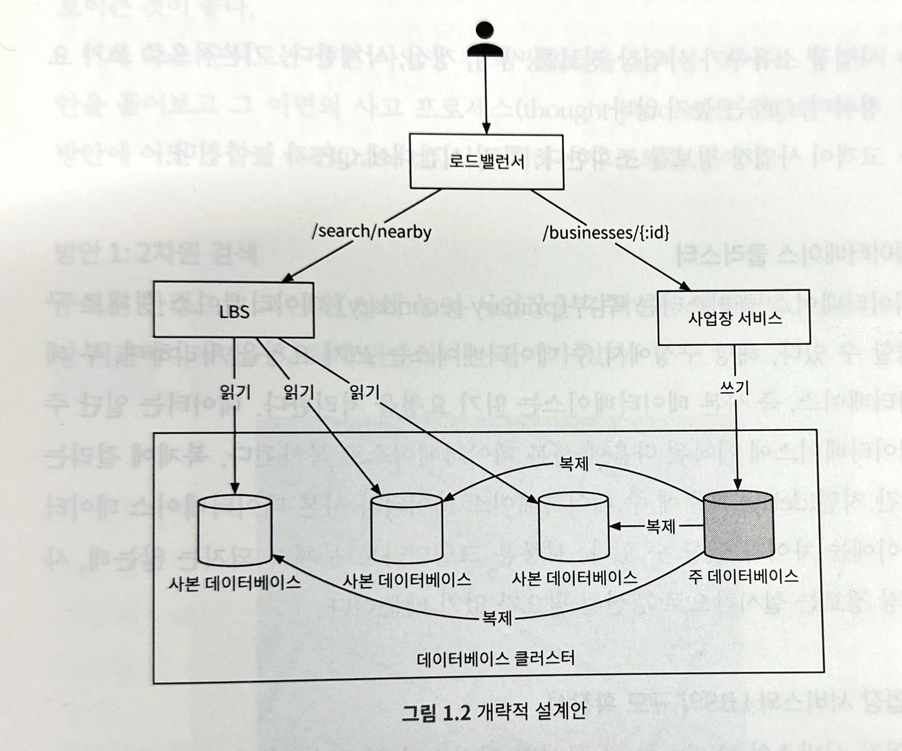
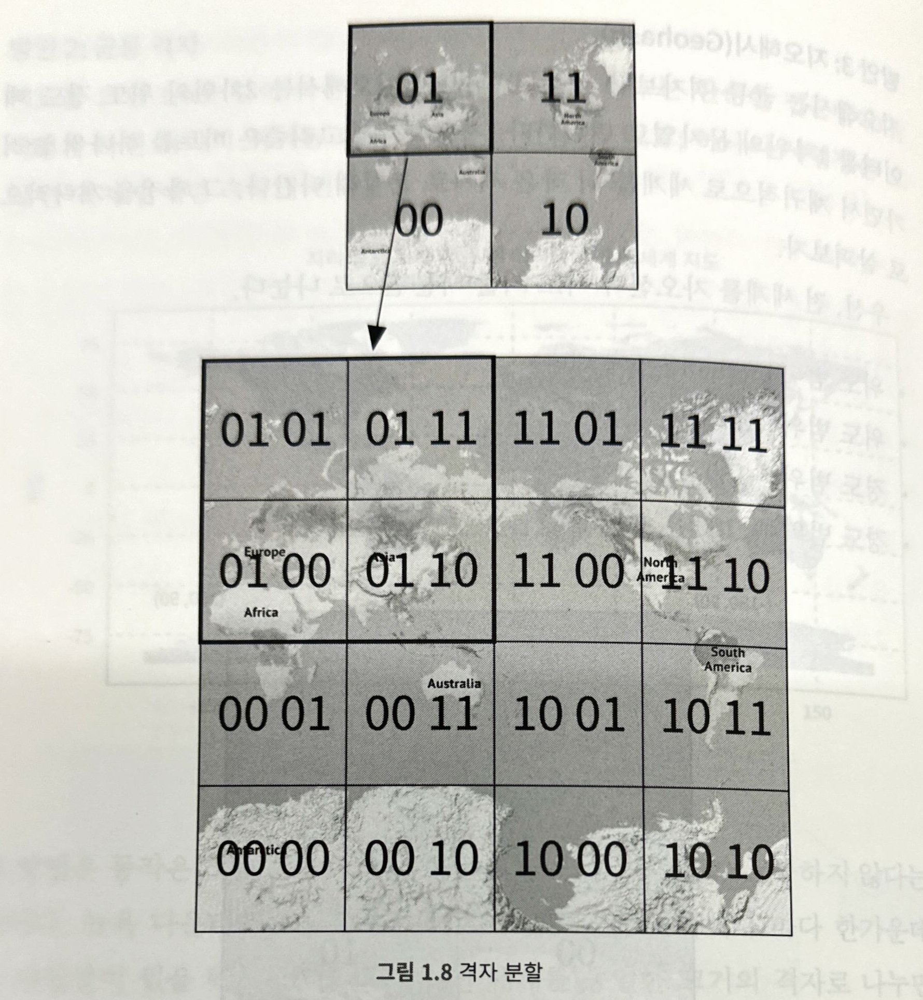
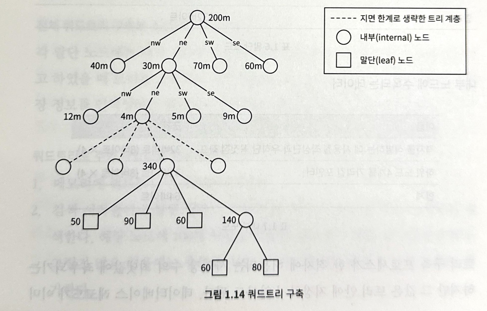
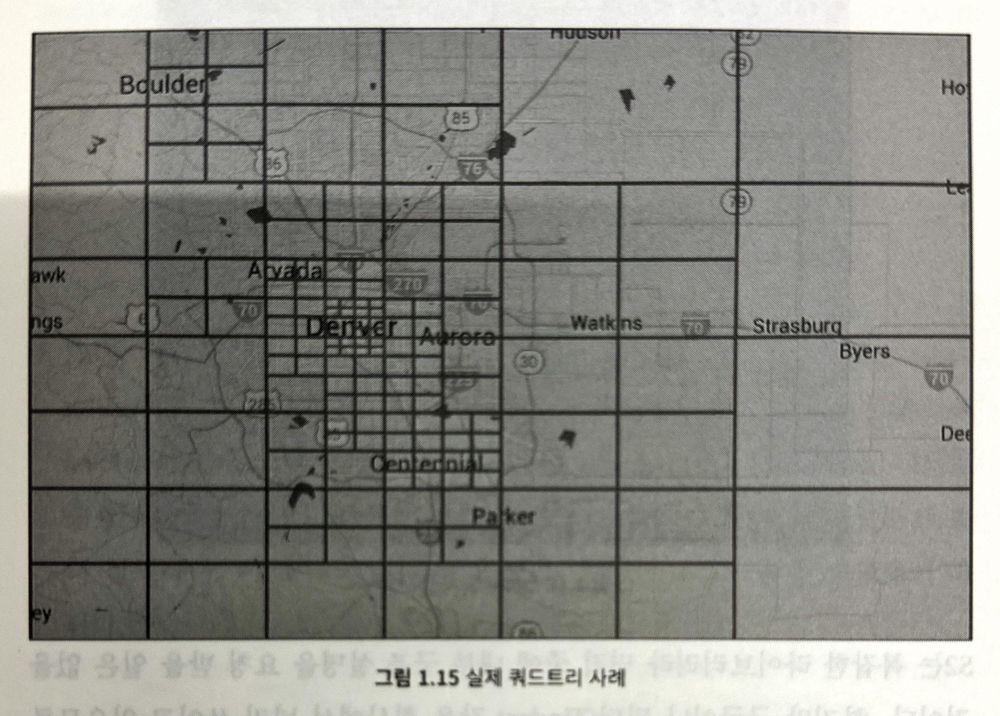
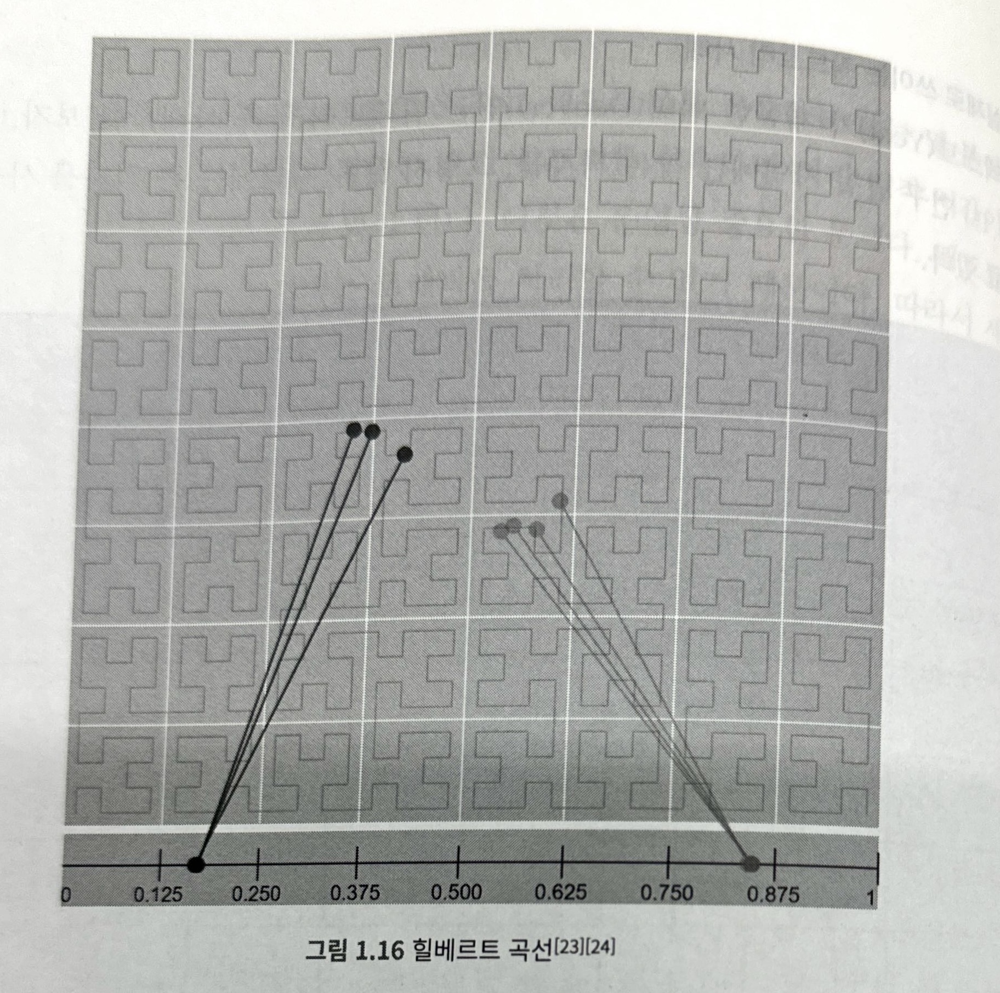
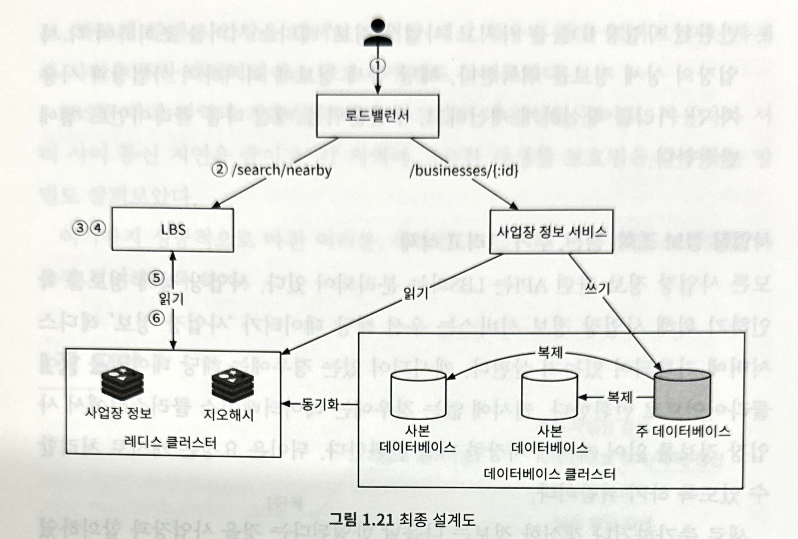

# 근접성 서비스

음식점, 호텔, 극장, 박물관 등 현재 위치에서 가까운 시설을 찾는 데 이용됨

# 문제 이해 및 설계 범위 확정

### 기능 요구사항

1. 사용자의 위치와 검색 반경 정보에 매치되는 사업장 목록을 반환
2. 사업장 소유추가 사업장 정보를 추가, 삭제, 갱신 가능하나 그 정보가 검색 결과에 실시간으로 반영될 필요는 없음
3. 고객은 사업장의 상세 정보를 살필 수 있음

### 비기능 요구사항

1. 낮은 응답 지연
    - 사용자는 주변 사업장을 신속히 검색할 수 있어야 함
2. 데이터 보호
    - 사용자 위치는 민감한 정보이기 때문에 보호 방법을 필수로 고려해야 함
    - GDPR이나 CCPA 같은 데이터 사생활 보호 법안을 준수해야 함
3. 고가용성 및 확장성
    - 인구 밀집 지역에서 이용자가 집중되는 시간에 트래픽이 급증해도 감당할 수 있도록

### 개략적 규모 추정

1. 일간 능동 사용자 DAU → 1억 명
2. 등록된 사업장 수 → 2억
3. Query per Second
    - 1일 = 24시간 * 60분 * 60초 = 86400: 반올림 해서 10^5
    - 한 사용자가 하루에 5회 검색을 시도한다고 가정
    - 1억 * 5억 / 10^5 = 5000

# 개략적 설계안 제시 및 동의 구하기

## API 설계

### **특정 검색 기준에 맞는 사업장 목록 반환 API**

GET /v1/search/nearby

페이지 분할을 적용해서 페이지 단위로 반환하는 것이 일반적이나 이번 장에서는 초점을 맞추지는 않음

| 필드 | 설명 | 자료형 |
| --- | --- | --- |
| latitude | 검색할 위도 | decimal |
| longitude | 검색할 경도 | decimal |
| radius | 반지름
optional | int |

```json
// 반환 값

{
	"total": 10,
	"businesses":[{business object}]
}
```

### **사업장 관련  API**

| API | 설명 |
| --- | --- |
| GET /v1/businesses/:id | 특정 사업장의 상세 정보 반환 |
| POST /v1/businesses | 새로운 사업장 추가 |
| PUT /v1/businesses/:id | 사업장 상세 정보 갱신 |
| DELETE /v1/businesses/:id | 특정 사업장 정보 삭제 |

## 데이터 모델

### **읽기/쓰기 비율**

**가장 많이 수행되는 읽기 연산**

- 주변 사업장 검색
- 사업장 정보 확인

**쓰기 연산은 실행 빈도가 낮음**

- 사업자 정보 추가, 삭제, 편집

⇒ 읽기 연산이 압도적인 시스템은 관계형 데이터베이스가 바람직

### **데이터 스키마**

**사업자 상세 정보 business 테이블**

| business_id (PK) |
| --- |
| address |
| city |
| state |
| country |
| latitude |
| longtitude |

**지리적 위치 색인 테이블**

위치 정보 관련 연산의 효율성을 높이는 데 쓰임

geohash에 대한 지식이 필요하기 때문에 → “데이터베이스의 규모 확장” 절에서 다시 논의

## 개략적 설계안



### 로드밸런서

유입 트래픽을 자동으로 여러 서비스에 분산시킴

단일 DNS 진입접을 지정하고, URL 경로를 분석하여 어느 서비스에 트래픽을 전달할지 결정

### 위치 기반 서비스 LBS

시스템의 핵심 부분

주어진 위치와 반경 정보를 이용해 주변 사업장을 검색

쓰기 요청이 없는, 읽기 요청만 빈번하게 발생하는 서비스

일반적으로 QPS가 높고, 특정 시간대의 인구 밀집 지역일수록 그 경향이 심함

무상태 서비스이기 때문에 수평적 규모 확장이 쉬움

### 사업장 서비스

1. 사업장 소유주가 사업장 정보를 생성, 갱신, 삭제함
2. 고객이 사업장 정보를 조회함

### 데이터베이스 클러스터

주-부(primary-secondary) 데이터베이스 형태로 구성 가능

주 데이터베이스는 쓰기 요청을 처리

부 데이터베이스(사본 데이터베이스)는 읽기 요청을 처리

주 데이터베이스에서 기록된 후 부 데이터베이스로 복사됨

복제에 걸리는 시간 지연 때문에 두 데이터베이스 사이에는 차이가 있을 수 있음

### 사업장 서비스와 LBS의 규모 확장성

둘 다 무상태 서비스이기 때문에 트래픽에 따라 서버를 추가하고 삭제함

시스템을 클라우드에 둔다면 여러 지역, 가용성 구역에 서버를 두어 시스템 가용성을 늘릴 수 있음

## 주변 사업장 검색 알고리즘

많은 회사가 Geohash in Redis나 PostGIS 확장을 설치한 Postgres 데이터베이스를 활용함

면접관은 이런 데이터베이스의 내부 구조를 알 거라고 기대하지 않음

지리적 위치 색인이 어떻게 동작하는지를 설명함으로써 문제 풀이 능력과 기술적 지식을 갖추었음을 보이는 것이 좋음

### 방안 1) 2차원 검색

주어진 반경으로 그린 원 안에 놓인 사업장을 검색하는 방법

가장 직관적이지만 지나치게 단순하다는 단점이 있음

```sql
-- 이 방법을 유사 SQL 질의문으로 옮겼을 때
-- 테이블 전부를 읽어야 하므로 효율적이지 않음

SELECT business_id, latitude, longtitude
FROM business
WHERE (latitude BETWEEN {:my_lat} - radius AND {:my_lat} + radius)
AND
	(longtitude BETWEEN {:my_long} - radius AND {:my_long} + radius)
```

**위도와 경도 칼럼에 색인을 만든다고 해도 효율이 개선되지 않음**

위도 칼럼과 경도 칼럼에 색인을 만들어 놓으면 데이터 집합 1과 데이터 집합 2는 빠르게 추출 가능

주어진 반경 내 사업장을 얻으려면 두 집합의 교집합을 구해야 함

각 집합에 속한 데이터의 양 때문에 효율적일 수 없음

⇒ 데이터베이스 색인으로는 오직 한 차원의 검색 속도만 개선이 가능하다는 문제

**2차원 데이터를 한 차원에 대응시킬 방법이 있을까?**

색인을 만드는 방법

- 해시 기반 방안: 균등 격자, Geohash, 카르테시안 계층
- 트리 기반 방안: 쿼드트리, 구글 S2,  R-tree

⇒ 모든 방안의 공통적인 개략적 아이디어는 지도를 작은 영역으로 분할하고 고속 검색이 가능하도록 색인을 만드는 것

### 방안 2) 균등 격자

지도를 작은 격자 또는 구획으로 나누는 단순한 접근법

하나의 격자는 여러 사업장을 담을 수 있음

하나의 사업장은 오직 한 격자에만 속하게 됨

**사업장 분포가 균등하지 않다는 문제**

전 세계를 동일한 크기의 격자로 나누면 데이터 분포는 전혀 균등하지 않음

이상적이기로는 인구 밀집 지역에는 작은 격자를, 그렇지 않은 지역에는 큰 격자를 사용하면 좋음

**주어진 격자의 인접 격자를 찾기가 까다로울 수 있다는 문제**

### 방안 3) Geohash

2차원의 위도 경도 데이터를 1차원의 문자열로 변환하는 방법

균등 격자보다 나은 방안



**비트를 하나씩 늘려가면서 재귀적으로 세계를 더 작은 격자로 분할함**

1. 전 세계를 자오선과 적도 기준 사분면으로 나눔
    - 위도 범위 [-90, 0]은 0에 대응
    - 위도 범위 [0, 90]은 1에 대응
    - 경도 범위 [-180, 0]은 0에 대응
    - 경도 범위 [0, 180]은 1에 대응
2. 그 각각의 격자를 또다시 사분면으로 나누는 과정을 원하는 정밀도를 얻을 때까지 반복
    - 각 격자는 경도와 위도 비트를 앞서 살펴본 순서대로 반복하여 표현
    - 통상적으로 base32 표현법을 사용

**Geohash는 12단계 정밀도를 가지고 있음**

| Geohash 길이 | 격자 너비 * 높이 |
| --- | --- |
| 1 | 5009.4km * 4992.6km (지구 전체) |
| 2 | 1252.3km * 624.1km |
| 3 | 156.5km * 156km |
| 4 | 39.1km * 19.5km |
| 5 | 4.9km * 4.9km |
| 6 | 1.2km * 609.4m |
| 7 | 152.9m * 152.4m |
| 8 | 38.2m * 19m |
| 9 | 4.8m * 4.8m |
| 10 | 1.2m * 59.5cm |
| 11 | 14.9cm * 14.9cm |
| 12 | 3.7cm * 1.9cm |

**최적 정밀도는 어떻게 정하는가?**

사용자가 지정한 반경으로 그린 원을 덮는 최소 크기 격자를 만드는 지오해시 길이를 구해야 함

| 반경 (km) | Geohash 길이 |
| --- | --- |
| 0.5km | 6 |
| 1km | 5 |
| 2km | 5 |
| 5km | 4 |
| 20km | 4 |

**대체로 잘 동작하지만 격자 가장자리 처리 방식에 관한 경계 조건이 몇 가지 있음**

1. 격자 가장자리 관련 이슈
    
    Geohash는 해시값의 공통 접두어가 긴 격자들이 서로 가깝게 놓이도록 보장함
    
    - 격자 가장자리 이슈 1
        - 아주 가까운 두 위치가 어떤 공통 접두어도 갖지 않는 일이 발생할 수 있음
        - 두 지점이 적도의 다른 쪽에 놓이거나, 자오선상의 다른 반쪽의 놓이는 경우
        - 단순하게 접두어 기반 SQL 질의문을 사용하면 주변 모든 사업장을 가져올 수 없음
    - 격자 가장자리 이슈 2
        - 두 지점이 공통 접두어 길이는 길지만 서로 다른 격자에 놓이는 경우
        - 현재 격자를 비롯한 인접한 모든 격자의 모든 사업장 정보를 가져오는 것이 가장 흔히 사용되는 해결책임
        - 특정 Geohash의 주변 Geohash를 찾는 것은 상수 시간에 가능한 연산임
2. 표시할 사업장이 충분하지 않은 이슈
    
    현재 격자와 주변 격자를 다 살펴보아도 표시할 사업장을 충분히 발견할 수 없는 경우에는?
    
    1. 주어진 반경 내 사업장만 반환
        - 구현하기 쉽지만 사용자의 욕구를 만족하기 충분한 수의 사업장 정보를 반환할 수 없음
    2. 검색 반경 키우기
        - Geohash 값의 마지막 비트를 삭제하여 얻은 새 Geohash 값을 사용해 주변 사업장을 검색
        - 충분한 사업장이 없을 경우 또 한 비트를 지워서 범위를 다시 확장하는 과정을 원하는 수 이상의 사업장을 얻을 때까지 반복

### 방안 4) 쿼드트리

격자의 내용이 특정 기준을 만족할 때까지 2차원 공간을 재귀적으로 사분면 분할하는 자료 구조

ex. 격자에 담긴 사업장 수가 100이하가 될 때까지 분할



쿼드트리를 사용한다 == 질의에 답하는 데 사용될 트리 구조를 메모리 안에 만드는 것

쿼드트리 ≠ 데이터베이스

이 자료 구조는 각각의 LBS 서버에 존재해야 하고, 서버가 시작하는 시점에 구축됨

**세계를 쿼드트리를 사용해 분할하는 과정**

루트 노드를 사분면 각각을 나타내는 하위 노드로, 어떤 노드의 사업장도 100개를 넘지 않을 때까지 재귀적으로 분할함

```java
// 이 과정을 의사 코드로 나타내면

public void buildQuadtree(TreeNode node) {
	if (countNumberOfBusinessesInCurrentGrid(node) > 100) {
		node.subdivide();
		for (TreeNode child: node.getChildren() {
			buildQuadtree(child);
		}
	}
}
```



**쿼리트리 전부를 저장하는 데 얼마나 많은 메모리가 필요한가?**

- 어떤 데이터가 쿼드트리에 보관되는지 먼저 알아야 함
    1. 말단 노드에 수록되는 데이터
        
        
        | 이름 | 크기 |
        | --- | --- |
        | 격자를 식별하는 데 사용될 좌상단과 우하단 꼭짓점 좌표 | 32바이트 (8바이트 * 4) |
        | 격자 내부 사업장 ID 목록 | ID당 8바이트 * 100 |
        | 합계 | 832바이트 |
    2. 내부 노드에 수록되는 데이터
        
        
        | 이름 | 크기 |
        | --- | --- |
        | 격자를 식별하는 데 사용될 좌상단과 우하단 꼭짓점 좌표 | 32바이트 (8바이트 * 4) |
        | 하위 노드 4개를 가리킬 포인터 | 32바이트 (8바이트 * 4) |
        | 합계 | 64바이트 |
- 격자 안에는 최대 100개 사업장이 있을 수 있음
- 말단 노드의 수 = ~200m/100 = ~2m (2백만)
- 내부 노드의 수 = 2m * (1/3) = ~0.67m
- 총 메모리 요구량 = (2m * 832 바이트) + (0.67m * 64바이트) = ~1.71GB
    - 트리를 구축하는 데 드는 부가적인 메모리 요구량을 감안해도 총 메모리 요구량이 꽤 작음
- 실제 면접장에서는 이 정도로 구체적인 계산이 필요하지는 않을 것이고, 그냥 쿼드트리 인덱스가 메모리를 많이 잡아먹지 않으므로 서버 한 대에 충분히 올릴 수 있다는 점만 확실히 알아 두면 됨
- 읽기 연산 양이 많이지면 서버 한 대의 CPU나 네트워크 대역폭으로는 감당하기 어려워질 수도 있기 때문에 읽기 연산을 여러 대 쿼드트리 서버로 분산시켜야 할 수도 있음

**전체 쿼드트리 구축에 소요되는 시간은?**

각 말단 노드에는 대략 100개 사업장 ID가 저장됨

전체 사업장 수를 n이라고 했을 때 트리를 구축하는 시간 복잡도 ⬇️

$$
 \frac{n}{100}log \frac{n}{100}
$$

**쿼드트리로 주변 사업장을 검색하려면?**

1. 메모리에 쿼드트리 인텍스를 구축
2. 검색 시작점이 포함된 말단 노드를 만날 때까지, 트리의 루트 노트부터 탐색
    - 해당 노드에 100개 사업장이 있는 경우에는 해당 노드만 반환
    - 그렇지 않은 경우에는 충분한 사업장 수가 확보될 때까지 인접 노드도 추가

**쿼드트리 운영 시 고려사항**

1. 서버를 시작하는 순산에 트리를 구축하면 서버 시작 시간이 길어질 수 있음
    - 운영상 중요한 문제임
    - 쿼드트리를 만들고 있는 동안 서버는 트래픽을 처리할 수 없기 때문
    - 새로운 버전의 서버 소프트웨어를 릴리즈 할 때는 동시에 너무 많은 서버에 배포하지 않도록 조심해야 함
    - 프로덕션 환경의 절반가량을 항상 실제 서비스가 아닌 신규 이미지 테스트에만 사용하고, 테스트에 통과한 경우 네트워크 설정을 조정하여 테스트 환경과 실제 서비스 환경을 맞바꾸는 배포 전략을 선택한 경우
        - 새 서버 소프트웨어를 테스트 환경의 모든 서버에 동시 배포하면 200m개 사업장 정보를 데이터베이스에서 동시에 읽게 되어 시스템에 큰 부하가 가해질 수 있다는 점을 유의
2. 시간이 흘러 사업장이 추가, 삭제되었을 때 쿼드트리를 갱신하는 문제
    - 가장 쉬운 방법은 점진적으로 갱신하는 것
        - 짧은 시간 동안이지만 낡은 데이터가 반환될 수 있음
        - 요구사항이 엄격하지 않다면 그 정도는 일반적으로 용인할 수 잇음
        - 수많은 키가 한 번에 무효화되어 캐시 서버에 막대한 부하가 가해질 수 있다는 단점
    - 실시간으로 갱신하는 것
        - 설계가 더 복잡해짐
        - 여러 스레드가 쿼드트리 자료 구조를 동시 접근하는 경우에는 더욱
        - 모종의 락 메커니즘을 사용해야 함

### 방안 5) 구글 S2

구글 S2 Geometry 라이브러리는 이 분야에서 아주 유명한 솔루션

쿼드트리와 마찬가지로, 메모리 기반



**힐베르트 곡선**

평면 위의 프랙탈 공간 채운 곡선의 하나

힐베르트 곡선 상에서 인접한 두 지점은 색인화 이후 1차원 공간 내에서도 인접한 위치에 있다는 것

1차원 공간 내에서의 검색은 2차원 공간에서의 검색보다 훨씬 효율적

S2는 복잡한 라이브러리라 면접 중에 내부 구조 설명을 요청 받을 일은 없을 것

장점만 간단하게 알고 있으면 됨

- 임의 지역에 다양한 수준의 영역 지정이 가능
    - Geofunce 구현에 그만
    - Geofunce는 실세계 지리적 영역에 설정한 가상의 경계
    - ‘특정 지점 반경 몇 km 이내’ 같은 식으로 동적으로 지정할 수도 있고, 스쿨 존이나 동네 경계처럼 이미 존재하는 경계선들을 묶어 설정할 수도 있음
    - 단순히 주변 사업장을 검색할 때보다 훨씬 풍부한 기능을 제공할 수 있음
- S2가 제공하는 영역 지정 알고리즘
    - Geohash처럼 고정된 정밀도를 사용하는 대신 최소 수준, 최고 수준, 최대 셀 개수 등을 지정할 수 있음
    - 셀 크기를 유연하게 조정할 수 있으므로 S2가 반환하는 결과가 좀 더 상세함

면접 시에는 Geohash나 쿼드트리 가운데 하나를 선택하기를 추천함

S2는 면접 시간 동안에 분명하게 설명하기에 까다로움

### Geohash vs 쿼드트리

**Geohash**

- 구현과 사용이 쉽고, 트리를 구축할 필요가 없음
- 지정 반경 이내 사업장 검색을 지원함
- 정밀도를 고정하면 격자 크기도 고정됨
    - 인구 밀도에 따라 동적으로 격자 크리를 조정할 수는 없음
- 색인 갱신이 쉬움

**쿼드트리**

- 트리 구축이 필요하기 때문에 구현하기가 살짝 더 까다로움
- k번째로 가까운 사업장까지의 목록을 구할 수 있음
    - 하위 노드 분할 과정이 숫자 k에 기반하고, k개 사업장을 찾을 때까지 검색 범위를 자동으로 조정 가능
- 인구 밀도에 따라 격자 크기를 동적으로 조정할 수 있음
- Geohash보다 색인 갱신이 까다로움
    - 쿼드트리는 말 그대로 트리 형태의 자료 구조임
    - 사업자 정보를 삭제하려면 루트 노드부터 말단 노드까지 트리를 순회해야 함
    - 순위 복잡도 == O(log n)
    - 다중 스레드를 지원해야 하면 락을 사용해야 하기 때문에 더욱 복잡해짐
    - 트리의 균형을 다시 맞추는 리밸런싱이 필요한 경우 더욱 복잡해짐

# 상세 설계

## 데이터베이스의 규모 확장성

**사업장 테이블**

한 서버에 담을 수 없을 수도 있음

샤딩(사업장 ID를 기준)을 적용하기 좋은 후보

모든 샤드에 부하를 고르게 분산 가능

운영적 측면에서도 관리하기 쉬움

**지리 정보 색인 테이블**

조금 더 단순한 Geohash를 사용했다고 가정

Geohash 테이블 구성 방법

1. 각각의 Geohash에 연결되는 모든 사업장 ID를 JSON 배열로 만들어 같은 열에 저장
    - 특정한 Geohash에 속한 모든 사업장 ID가 한 열에 보관됨
2. 같은 Geohash에 속한 사업장 ID 각각을 별도 열로 저장
    - 사업장마다 한 개의 레코드가 더 필요함
    - 이 방법을 더 추천함
        - 방안 1을 사용할 경우, 사업장 정보를 갱신하려면 JSON 배열을 읽은 다음에 갱신할 사업장 ID를 찾아내야 함(새 사업장 정보를 추가할 때도)
        - 방안 1을 사용할 경우, 병렬적으로 실행되는 갱신 연산 결과로 데이터가 소실되는 경우를 막기 위해 락을 사용해야 함
        - Geohash와 사업장 ID 칼럼을 복합 키로 사용하면 사업장 정보를 추가하고 삭제하기 쉬움

**지리 정보 색인의 규모 확장**

읽기 연산의 빈도가 많으면 뎌러 데이터베이스 서버로 부하를 분산해야 함

1. 읽기 연산을 지원할 사본 데이터베이스 서버를 늘리기
2. 샤딩 적용
    - Geohash는 샤딩이 까다롭기 때문에 면접에서 이야기하지 않는 것이 좋음
    - 애플리케이션을 구현해야 함

## 캐시

**캐시가 정말 필요한지 먼저 확인할 필요가 있음**

- 처리 부하가 읽기 중심이기 때문에 데이터베이스 크기는 상대적으로 작아서 모든 데이터를 한 대 데이터베이스 서버에 수용이 가능함
- 질의문 처리 청능은 메모리 캐시를 사용할 때와 비슷함
- 읽기 성능이 병목이라면 사본 데이터베이스를 증설해서 읽기 대역폭을 늘릴 수 있음

면접관과 캐시 도입을 의논할 때는 벤치마킹과 비용 분석에 각별히 주의해야 함

캐시가 사업적 요구사항을 만족하는 데 중요한 역할이라는 확신이 들면 캐시 전략 논의 진행

**캐시 키**

가장 직관적인 캐시 키는 사용자 위치의 위도 경도 정보

- 사용자의 전화기에서 반환되는 위치 정보는 추정치일 뿐
- 전혀 움직이지 않더라고 측정할 때마다 조금씩 달라짐
- 사용자가 이동하면 해당 위도 및 경도 정보도 미세하게 변경됨

⇒ 사용자의 위치 정보는 캐시키로 적절하지 않음

⇒ Geohash나 쿼드트리는 같은 격자 내 모든 사업장이 같은 해시 값을 갖도록 만들 수 있기 때문에 이 문제를 효과적으로 새결 가능

**캐시 데이터 유형**

해당 데이터는 캐시에 보관하면 시스템의 성능을 전반적으로 향상시킬 수 있음

1. Geohash: 해당 격자 내의 사업장 ID 목록
    - 사업장 정보는 상대적으로 안정적이라 자주 변경되지 않음
    - 특정 Geohash에 해당하는 사업장 ID 목록을 미리 계산한 다음 키-값 저장소에 캐시할 수 있음
    - 주변 사업장을 검색하는 구체적인 사례
        - 주어진 Geohash에 대응되는 사업장 목록 구하는 질의
            
            ```sql
            SELECT business_id
            FROM geohash_index
            WHERE geohash LIKE '%{: geohash}%'
            ```
            
        - 주어진 Geohash에 대응되는 사업장 목록을 요청받으면 일단 캐시를 먼저 조회하고 없으면 1번 질의를 사용하여 자업장 목록을 데이터베이스에서 가져온 다음 캐시에 보관함
            
            ```java
            public List<String> getNearbyBusinessIds(String geohash) {
            	String cacheKey = hash(geohash);
            	List<String> listOfBusinessIds = Redis.get(cacheKey);
            	if (listOfBusinessIds == null) {
            		listOfBusinessIds == 위의 SQL 질의문을 실행하여 구함;
            		Cache.set(cacheKey, listOfBusinessIds, "1d");
            	}
            	return listOfBusinessIds;
            }
            ```
            
    - 주어진 요구사항에 따르면 사용자는 500m, 1km, 2km, 5km 반경 중 하나를 선택할 수 있고, 이 반경은 각각 Geohash에서 4, 5, 6에 해당되기 때문에 이 세 가지 정밀도 전부에 대한 검색 결과를 Redis에 캐시해 두어야 한다
        - Redis 저장소에 값을 저장하기 위한 필요 공간 = 8바이트 * 200m * 3가지 정밀도 = ~5GB
        - Redis 저장소에 키를 저장하기 위한 필요 공간 = 무시
        - 전체 메모리 요구량 = 대략 5GB
        - 서버 한 대로도 충분할 것 같지만 고가용성을 보장하고, 대륙 경계를 넘는 트래픽의 전송 지연을 방지하기 위해 Redis Cluster를 전 세계에 각 지역별로 두고, 동일한 데이터를 각 지역에 중복해서 저장해 두어야 함
2. 사업장 ID: 사업장 정보 객체
    - 키는 business_id, 값은 사업장 이름, 주소, 사진 등의 정보를 담은 객체

## 지역 및 가용성 구역

**위치 기반 서비스를 여러 지역과 가용성 구역에 설치하면서 바라는 기대 효과**

1. 사용자와 시스템 사이의 물리적 거리를 최소화
2. 트래픽을 인구에 따라 고르게  분산하는 유연성 확보
    - 인구 밀도에 따라 조정 가능
3. 해당 지역의 사행활 보호법에 맞는 운영 가능

## 시간대, 혹은 사업장 유형에 따른 검색

**지금 영업 중인 사업장, 혹은 식당 정보만 받아오고 싶다면 어떻게 하겠는가?**

Geohash나 쿼드트리 같은 메커니즘을 통해 전 세계를 작은 격자들로 분할하면 검색 결과로 얻어지는 사업장 수는 상대적으로 적음

일단 근처 사업장 ID부터 전부 확보한 다음 그 사업자 정보를 전부 추출해서 영업 시간이나 사업장 유형에 따라 피터링

영업 시간이나 사업장 유형 같은 정보는 사업자 정보 테이블에 이미 보관되어 있어야 함

## 최종 설계도



**주변 사업장 검색**

옐프에서 주변 반경 500m 내 모든 식당을 찾는 경우

1. 클러이언트 앱이 사용자의 위치(위도, 경도 정보)와 검색 반경을 로드밸런서로 전송
2. 로드밸런서는 해당 요청을 LBS로 전송
3. 주어진 사용자 위치와 반경 정보에 의거하여, LBS는 검색 요건을 만족할 Geohash를 계산
4. LBS는 인접한 Geohash를 계산한 다음 다음 목록에 추가
    
    ```java
    list_of_geohashes = [my_geohash, nighbor1_geohash, nighbor2_geohash, ...]
    ```
    
5. list_of_geohashes 내에 있는 Geohash 각각에 대해 LBS는 ‘Geohash’ Redis 서버를 호출하여 해당 Geohash에 대응하는 모든 사업장 ID를 추출
    - Geohash별로 사업장 ID 목록을 가져오는 연산을 병렬적으로 수행하면 검색 결과를 내는 지연시간을 줄일 수 있음
6. 반환된 사업장 ID들을 가지고 ‘사업장 정보’ Redis 서버를 조회하여 각 사업장의 상세 정보를 취득
7. 해당 상세 정보에 의거하여 사업장과 사용자 간 거리를 확실하게 계산하고, 우선순위를 매긴 다음 클라이언트 앱에 반환

**사업장 정보 조회, 갱신, 그리고 삭제**

- 모든 사업장 정보 관련 API는 LBS와 분리되어 있음
- 자업자 상세 정보를 확인하는 과정은 Redis 서버에 ‘사업장 정보’가 기록되어 있는지 확인 후 있으면 반환, 없으면 데이터베이스에서 정보를 읽어 캐시에 저장한 다음 반환
- 새로 추가하거나 갱신한 정보는 다음날 반영된다는 것을 사업장과 합의했기 때문에 캐시에 보관된 정보 갱신은 밤사이 작업을 돌려서 처리

# 마무리

주변 검색 기능의 핵심인 근접성 서비스를 설계함

지리 정보 색인 기법을 활용하는 전형적인 LBS

- 2차원 검색
- 균등 분할 격자
- Geohash
- 쿼드트리
- 구글 S2

# 토론

**우선 순위를 거리상이 아닌 사용자 맞춤형 추천으로 변경하려면 어떤 것들을 고려해야 할까?**

- 회원의 검색 정보 및 선택 정보 추적
    - 지금보다 많은 정보를 수집해야 함
- 데이터 분석
- 알고리즘 적용
    - 특정 장소와 관련된 단어, 특징, …
    - 회원이 선호하는 단어, 특징, …
- 피드백 반영: 특정 장소 좋아요/싫어요, 리뷰, 별점, …
