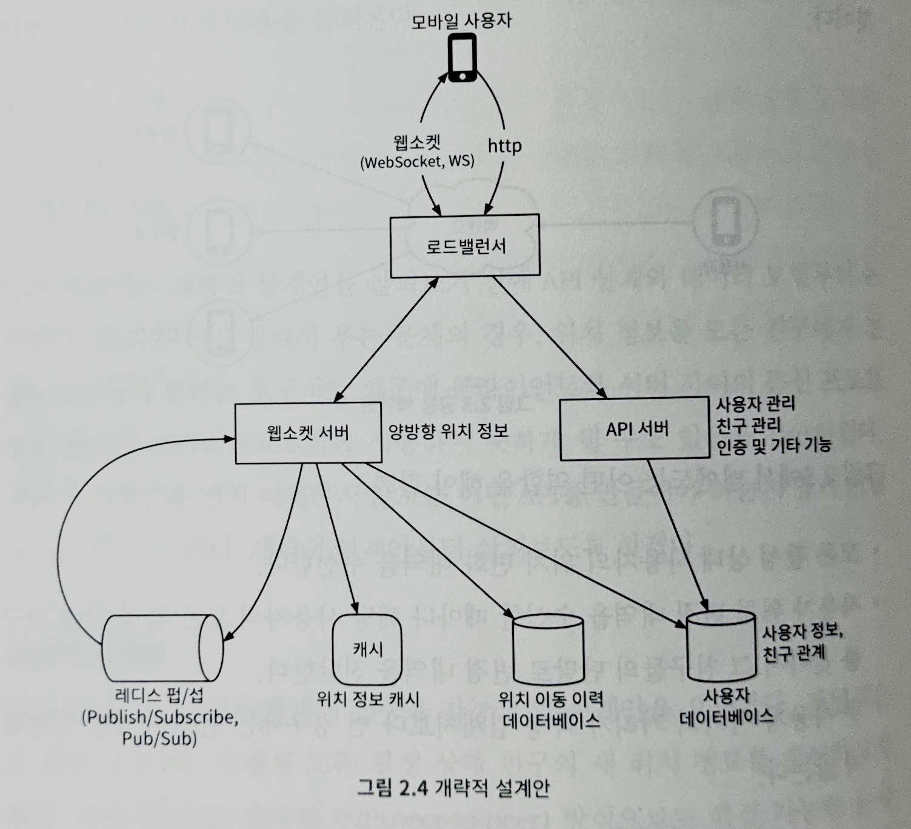

# 주변 친구

본인 위치 정보 접근 권한을 허락한 사용자에 한해 인근의 친구 목록을 보여주는 시스템

1장과 다른 점은 주변 친구 위치가 자주 바뀐다는 것

# 문제 이해 및 설계 범위 확정

### 기능 요구사항

1. 사용자는 모바일 앱에서 주변 친구를 확인할 수 있어야 함
2. 해당 친구까지의 거리, 해당 정보가 마지막으로 갱신된 시각도 알 수 있어야 함
3. 친구 목록은 몇 소의 한 번씩 갱신되어야 함

### 비기능 요구사항

1. 낮은 지연 시간
    - 주변 친구의 위치 변화 반영이 너무 오래걸리지 않아야 함
2. 안정성
    - 시스템은 전반적으로 안정적이어야 함
    - 몇 개의 데이터가 유실되는 것 정도는 용인 가능
3. 결과적 일관성
    - 복제본의 데이터가 원본과 동일하게 변경되기까지 몇 초 정도 걸리는 것은 용인 가능

### 개략적 규모 추정

1. ‘주변 친구’는 8km 반경 이내 친구로 정의
2. 친구 위치 정보는 30초 주기로 갱신
3. 평균적으로 매일 주변 친구 검색 기능을 활용하는 사용자는 1억 명으로 가정
4. 동시 접속 사용자의 수는 일간 능동 사용자 DAU 수의 10%로 가정 = 천만 명
5. 평균적으로 한 사용자는 400명의 친구들 갖고, 모두가 주변 친구 검색 기능을 활용한다고 가정
6. 페이지당 20명의 주변 친구를 표시하고, 사용자의 요청이 있으면 더 많은 친구를 보여 줌
7. Query per Second
    - 1억 DAU
    - 동시 접속 사용자 = 10% * 1억 = 천만
    - 사용자는 30초마다 자기 위치를 시스템에 전송
    - 위치 정보 갱신 QPS = 천만/30 = ~334000

# 개략적 설계안 제시 및 동의 구하기

## 개략적 설계안

메시지의 효과적 전송을 가능케 할 설계안

근방의 모든 활성 상태 친구의 새 위치 정보를 수신하고자 함

활성 상태인 근방 모든 친구와 항구적 통신 생태를 유지하면 됨

**모바일 단말**

통신 연결 상태가 좋지 않을 수 있음

사용할 수 있는 전력이 충분치 않음

⇒ 실용적인 아이디어는 아님

⇒ 조금 더 실용적인 설계안은 **공용 백엔드**

**공용 백엔드는 어떤 역할을 해야 할까?**

1. 모든 활성 상태 사용자의 위치 변화 내역을 수신함
2. 사용자 위치 변경 내역을 수신할 때마다 해당 사용자의 모든 활성 상태 친구를 찾아서 그 친구들의 단말로 변경 내역을 전달함
3. 두 사용자 사이의 거리가 특정 임계치보다 먼 경우에는 변경 내역을 전송하지 않음

⇒ 단순하고 명괘하지만, 큰 규모에 적용하기 쉽지 않다는 단점이 있음

### **소규모 백엔드를 위한 개략적 설계안**

~~상세 설계에서 더 큰 규모에 맞게 확장할 것~~



**로드밸런서**

- RESTful API 서버 및 양방향 유상태 웹소켓 서버 앞단에 위치
- 부하를 고르게 분산하기 위해 트래픽 서버들에 배분

**RESTful API**


- 무상태 API 서버의 클러스터
- 통상적인 요청/응답 트래픽을 처리함
- 친구를 추가/삭제하거나 사용자 정보를 갱신하는 등의 부가적인 작업을 처리

**웹소켓 서버**

- 친구 위치 정보 변경을 거의 실시간에 가깝게 처리하는 유상태 서버 클러스터
- 각 클라이언트는 그 가운데 한 대와 웹 소켓 연결을 지속적으로 유지
    - 검색 반경 내 친구 위치가 변경되면 해당 내역은 이 연결을 통해 클라이언트로 전송
- 주변 친구 기능을 이용하는 클라이언트의 초기화 담당
    - 모바일 클라이언트가 시작되면, 온라인 상태인 모든 주변 친구 위치를 해당 클라이언트로 전송

**Redis 위치 정보 캐시**

- 활성 상태 사용자의 가장 최근 위치 정보를 캐시
- TTL이 만료되면 해당 사용자는 비활성 상태로 바꾸고, 캐시 삭제

**사용자 데이터베이스**

- 사용자 데이터 및 사용자의 친구 관계 정보 저장

**위치 이동 이력 데이터베이스**

- 사용자의 위치 변동 이력 저장
- 주변 친구 표시와 직접 관계된 기능 X

**Redis Pub/Sub 서버**


- 초경량 메시지 버스
- Redis Pub/Sub 서버에 새로운 채널을 생성하는 것은 값싼 연산
    - 기가바이트급 메모리를 갖춘 Redis 서버에는 수백만 개의 채널 생성 가능
- 동작 원리
    1. 웹소켓 서버를 통해 수신한 특정 사용자의 위치 정보 변경 이벤트는 해당 사용자에게 배정된 Pub/Sub 채널에 발행
    2. 해당 사용자의 친구 각각과 연결된 웹소켓 연결 핸들러는 해당 채널의 구독자로 설정됨
    3. 특정 사용자의 위치가 바뀌면 해당 사용자의 모든 친구의 웹소켓 연결 핸들러가 호출됨
    4. 각 핸들러는 위치 변경 이벤트를 수신할 친구가 활성 상태면 거리를 다시 계산함
    5. 새로 계산한 거리가 검색 반경 이내면 갱신된 위치와 갱신 시각을 웹소켓 연결을 통해 해당 친구의 클라이언트 앱으로 전송

**주기적 위치 갱신**


1. 모바일 클라이언트가 위치가 변경된 사실을 로드밸런서에 전송
2. 로드밸런서는 그 위치 변경 내역을 해당 클라이언트와 웹소켓 서버 사이에 설정된 연결을 통해 웹소켓 서버로 보냄
3. 웹소켓 서버는 해당 이벤트를 위치 이동 이력 데이터베이스에 저장
4. 웹소켓 서버는 새 위치를 위치 정보 캐시에 보관
    - TTL 갱신
    - 웹소켓 연결 핸들러 안의 변수에 해당 위치를 반영하고, 그 값은 거리 계산 과정에 사용
5. Redis Pub/Sub 서버의 해당 사용자 채널에 새 위치를 발행함
    - 3~5단계는 병렬적으로 수행됨
6. Redis Pub/Sub 채널에 발행된 새로운 위치 변경 이벤트는 모든 구독자에게 브로드캐스트됨
    - 구독자 == 위치 변경 이벤트를 보낸 사용자의 온라인 상태 친구들
7. 메시지를 받은 웹소켓 서버는 새 위치를 보낸 사용자와 메시지를 받은 사용자 사이의 거리를 새로 계산
    - 계산한 값이 검색 반경을 넘지 않는다면, 새 위치 및 해당 위치로의 이동이 발생한 시각을 나타내는 타임스탬프를 해당 구독자의 클라이언트 앱으로 전송하고, 반경을 넘는 경우에는 보내지 않음

**주기적 위치 갱신의 구체적인 예시**


1. 사용자 1의 위치가 변경되면 그 변경 내역이 사용자 1과의 연결을 유지하고 있는 웹소켓 서버에 전송
2. 해당 변경 내역이  Redis Pub/Sub 서버 내의 사용자 1 전용 채널로 발행
3. Redis Pub/Sub 서버는 해당 변경 내역을 모든 구독자에게 브로드캐스트함
    - 구독자 == 사용자 1과 친구 관계에 있는 모든 웹소켓 연결 핸들러
4. 위치 변경 내역을 보낸 사용자와 구독자 사이의 거리가 검색 반경을 넘지 않을 경우, 새로운 위치는 사용자 2의 클라이언트로 전송됨
    - 위치 변경 내역을 보낸 사용자와 구독자 사이의 거리 == 사용자 1과 2 사이의 거리

⇒ 이 계산 과정은 해당 채널의 모든 구독자에게 반복 적용

## API 설계

1. [서버 API] 주기적인 위치 정보 갱신 API
2. [클라이언트 API] 클라이언트가 갱신된 친구 위치를 수신하는 데 사용할 API
3. [서버 API] 웹소켓 초기화 API
4. [클라이언트 API] 새 친구 구독 API
5. [클라이언트 API] 구독 해지 API

## 데이터 모델

~~사용자 데이터베이스에 대해서는 개략적 설계안에서 설명함~~

**위치 정보 캐시**

‘주변 친구’ 기능을 켠 활성 상태 친구의 최근 위치를 보관

Redis를 사용해 캐시 구현

| 키 | 값 |
| --- | --- |
| 사용자 ID | {위도, 경도, 시각} |

**위치 정보 저장에 데이터베이스를 사용하지 않는 이유는?**

‘주변 친구’ 기능은 현재 위치만 사용함 == 사용자 위치는 하나만 보관하면 충분

Redis를 사용한 이유는 읽기 및 쓰기 연산 속도가 엄청나게 빠르고, TTL을 지원하기 때문

영속성을 보장할 필요 없기 때문에 서버에 장애가 생겨도 새 서버로 바꾸고, 캐시에 채워지기 기다리면 됨

~~캐시가 교체되는 동안 사용자에게 발생 가능한 문제를 줄일 방안은 상세 설계에서~~

**위치 이동 이력 데이터베이스**

사용자의 위치 정보 변경 이력을 저장

| user_id | latitude | longitude | timestamp |
| --- | --- | --- | --- |

막대한 쓰기 연산 부하를 감당할 수 있어야 함

수평적 규모 확장이 가능해야 함

⇒ 카산드라 선택

⇒ 관계형 데이터베이스도 사용할 수 있으나, 이력 데이터의 양이 서버 한 대에 보관하기에는 너무 많을 수 있기 때문에 샤딩 필수

# 상세 설계

## 중요 구성요소별 규모 확장성

**웹소켓 서버**

- 웹소켓 서버 == 유상태 서버
- 기존 서버를 제거할 때 주의해야 함
    - 노드를 제거하기 전에 기존 연결부터 종료될 수 있도록 해야 함
    - 로드밸런서가 인식하는 노트 상태를 ‘연결 종료 중’으로 변경하면 그 서버로는 새로운 웹소켓 연결이 만들어지지 않음
    - 모든 연결이 종료된 후 서버를 제거해야 함
    - 새로운 버전의 애플리케이션 소프트웨어를 설지할 때도 마찬가지

⇒ 유상태 서버 클러스트의 규모를 자동으로 확장하려면 좋은 로드밸런서가 있어야 한다는 뜻

**클라이언트 초기화**

- 모바일 클라이언트는 기동되면 웬소켓 클러스터 내의 서버 가운데 하나와 지속성 웹소켓 연결을 맺음
- 지속성 연결 == 연결이 오랜 시간 유지됨
    - 연결 유지에 많은 메모리를 필요로 하지 않음
- 웹소켓 연결이 초기화되면 클라이언트는 해당 모바일 단말의 위치(단말을 이용하는 사용자의 위치 정보)를 전송하고, 그 정보를 받은 웹소켓 연결 핸들러는 아래 작업을 수행함
    1. 위치 정보 캐시에 보관된 해당 사용자의 위치를 갱신
        - 해당 위치 정보는 계산 과정에 필요하기 때문에 연결 핸들러 내의 변수에 저장함
    2. 사용자 데이터베이스를 뒤져 해당 사용자의 모든 친구 정보를 조회함
    3. 위치 정보 캐시에 일괄 요청을 보내서 모든 친구의 위치를 한번에 조회함
        - 캐시에 보관하는 모든 항목의 TTL은 비활성화 타임아웃 시간과 동일한 값으로 설정되어 있기 때문에 비활성화 친구의 위치는 캐시에 없을 것
    4. 웹소켓 서버는 해당 친구의 각 위치와 사용자 사이의 거리를 계산함
        - 그 거리가 검색 반경 이내면 해당 친구의 상세 정보, 위치, 해당 위치가 마지막으로 확인된 시각을 웹소켓 연결을 통해 클라이언트에 반환
    5. 웹소켓 서버는 각 친구의 Redis Pub/Sub 채널을 구독함
        - 채널 생성 및 구독 비용은 저렴하기 때문에 친구의 활성화 여부와 관계없이 모든 친구 채널을 구독함
    6. 사용자의 현재 위치를 Redis Pub/Sub 서버의 전용 채널을 통해 모든 친구에게 전송함

**사용자 데이터베이스**

- 보관되는 데이터
    1. 사용자 상세 정보
        - 사용자 ID, 사용자명, 프로파일 이미지 URL, …
    2. 친구 관계 데이터
- 설계안의 규모를 보면 한 대의 관계형 데이터베이스 서버로는 관리 불가능
    - 사용자 ID를 기준으로 데이터를 샤딩하여 수평적 규모 확장
- 실제로 운영할 경우, 사용자 및 친구 데이터를 관리하는 팀이 따로 필요할 것
    - API 호출을 통해 데이터를 조회해야 함

**위치 정보 캐시**

- Redis 사용
- TTL은 해당 사용자의 위치 정보가 갱신될 때마다 초기화됨
    - 최대 메모리 사용량이 일정 한도 아래로 유지됨
    
    ⇒ Redis 서버 한 대로 모든 위치 정보 캐시 가능
    
- 천만 명의 사용자가 30초마다 변경된 위치 정보를 전송할 경우에는 Redis 서버에 부담이 될 수 있음
    - 사용자 ID를 기준으로 여러 서버에 샤딩하여 부하 분배
- 가용성 높이기
    - 각 샤드에 보관하는 위치 정보를 대기 노드에 복제하기
    - 주 노드에 장애가 발생하면 대기 노드를 주 노드로 승격시켜 장애시간 줄이기 가능

### **Redis Pub/Sub 서버**

- 모든 온라인 친구에게 보내는 위치 변경 내역 메시지의 라우팅 계층으로 활용
- 새 채널은 구독하려는 채널이 없을 때 생성함
- 구독자가 없는 채널로 전송된 메시지는 버려짐
    - 서버에 가해지는 부하는 거의 없음
- 채널 하나를 유지하기 위해서는 구독자 관계를 추적하기 위한 해시 테이블과 연결 리스트가 필요함
    - 소량의 메모리만을 사용함
- 오프라인 사용자라 어떤 변경도 없는 채널은 생성된 이후에 CPU 자원은 전혀 사용하지 않음

**설계안이 위에 언급한 특징을 활용하는 법**

1. ‘주변 친구’ 기능을 활용하는 모든 사용자에게 채널을 하나씩 부여
    - 해당 기능을 사용하는 사용자의 앱은 초기화 시에 모든 친구의 채널과 구독 관계를 설정
    - 친구의 상태는 개의치 않음 == 설계가 단순해짐
2. 더 많은 메모리를 사용하게 되지만, 메모리가 병목될 가능성은 낮음
    - ‘주변 친구’ 기능은 아키텍처를 단순하게 만들 수 있다면 더 많은 메모리를 투입할 만한 가치가 충분함

**얼마나 많은 Redis Pub/Sub 서버가 필요한가?**

| 메모리 사용량 | 주변 친구 기능을 사용하는 모든 사용자에게 채널을 하나씩 할당 = 1억 개
한 사용자의 활성화 상태 친구 중 100명이 주변 친구 기능을 사용
구독자 한 명을 추적하기 위해 내부 해시 테이블과 연결 리스트에 20바이트 사용
모든 채널을 저장 = 200GB(1억 * 20바이트 * 100명의 친구 * 10^9)
100GB의 메모리를 설치할 수 있는 최신 서버 사용 = Redis Pub/Sub 서버 두 대 |
| --- | --- |
| CPU 사용량 | Redis Pub/Sub 서버가 구독자에게 전송해야 하는 위치 정보 업데이트 양 = 초당 1400만 건
서버 한 대로 감당 가능한 구독자의 수는 100,000명이라고 가정
필요한 Redis 서버의 수 = 1400만 / 100,00 = 140대
보수적으로 계산한 것을 감안하면 140대보다는 작을 것 |

⇒ Redis Pub/Sub 서버의 병목은 메모리가 아니라 CPU 사용량

⇒ 설계안에서 풀어야 하는 문제의 규모를 감당하려면 분산 Redis Pub/Sub 클러스터가 필요함

**분산 Redis Pub/Sub 서버 클러스터**

- 모든 채널은 서로 독립적임
- 메시지를 발행할 사용자 ID를 기준으로 Pub/Sub 서버들을 샤딩하면 됨
    - 수백 대의 Pub/Sub 서버가 관련된 문제이기 때문에 동작 방식을 상세하게 볼 필요가 있음
- 설계안에서는 서비스 탐색 컴포넌트를 도입하여 이 문제를 풀고 있음
    - 서비스 탐색 컴포넌트로 사용가능한 소프트웨어
        - etcd, 주키퍼, …
- 설계안에서 사용할 서비스 탐색 컴포넌트 기능
    1. 가용한 서버 목록을 유지하는 기능 및 해당 목록을 갱신하는 데 필요한 UI 혹은 API
        - 서비스 탐색 소프트웨어 == 설정 데이터를 보관하기 위한 소규모의 키-값 저장소
        - ‘키’에 매달린 ‘값’에는 활성 상태의 모든 Redis Pub/Sub 서버로 구성된 해시 링을 보관함
        - 메시지를 발행할 채널이나 구독할 채널을 정해야 할 때 해시 링을 참조함
        
        
        
        ```json
        {
        	"/config/puhb_sub_ring": [
        		"p_1",
        		"p_2",
        		"p_3",
        		"p_4"
        	]
        }
        ```
        
    2. 클라이언트로 하여금 ‘값’에 명시된 Redis Pub/Sub 서버에서 발생한 변경 내역을 구독할 수 있는 기능

**웹소켓 서버가 특정 사용자 채널에 위치 정보 변경 내역을 발행하는 과정**


1. 웹소켓 서버는 해시 링을 참조하여 메시지를 발행할 Redis Pub/Sub 서버를 선정함
    - 정확한 정보는 서비스 탐색 컴포넌트에 보관되어 있지만 성능 효율을 높이기 위해 해시 링 사본을 웹소켓 서버에 캐시하는 것도 생각해 볼 수 있음
    - 캐시를 사용할 경우, 웹소켓 서버는 해시 링 원본에 구독 관계를 설정하여 사본의 상태를 항상 원본과 동일하게 유지해야 함
2. 웹소켓 서버는 해당 서버가 관리하는 사용자 채널에 위치 정보 변경 내역을 발행함

**Redis Pub/Sub 서버 클러스터의 속성**

1. Pub/Sub 서버에 전송되는 메시지는 메모리나 디스크에 지속정으로 보관되지 않음
    - 채널의 모든 구독자에게 전송되고 나면 바로 삭제되고, 구독자가 아예 없는 경우에는 그냥 지워짐
    - 이런 관점에서 볼 경우, Pub/Sub 채널을 통해 처리되는 데이터는 무상태임
2. Pub/Sub 서버는 채널에 대한 상태 정보를 보관함
    - 각 채널의 구독자 목록은 그 상태 정보의 핵심적인 부분
    - 특정한 채널을 담당하던 Pub/Sub 서버를 교체하거나 해시 링에서 제거하는 경우, 채널은 다른 서버로 이동시킴과 동시에 해당 채널의 모든 구독자에게 그 사실을 알려야 함
    - 이런 관점에서 보면 Pub/Sub 서버는 유상태 서버임
    - 서비스의 장애를 최소화하려면 해당 서버가 관리하는 채널에 구독 관계를 설정한 모든 구독자와 적절히 협력해야 함

⇒ Redis Pub/Sub 서버 클러스터는 유상태 클러스터로 취급하는 것이 바람직함 

**Redis Pub/Sub 서버 클러스터의 규모 확장 고려사항**

- 유상태 서버 클러스트의 규모를 늘리거나 줄이는 것은 운영 부담과 위험이 큰 작업
- 혼잡 시간대 트래픽을 무리 없이 감당하고 불필요한 크기 변화를 피할 수 있도록 어느 정도 여유를 두고 오버 프로비저닝을 하는 것이 일반적
- 불가피하게 클러스트 크기를 늘리게 될 경우?
    - 많은 채널이 같은 해시 링 위의 다른 여러 서버로 이동할 것이고, 서비스 탐색 컴포넌트가 모든 웹소켓 서버에 해시 링이 갱신되었음을 알리면 엄청난 재구독이 발생할 것
    - 재구독 요청을 처리하다 보면 클라이언트가 보내는 위치 정보 변경 메시지의 처리가 누락될 수 있다
    - 서비스의 상태가 불안정해질 가능성이 있기 때문에 크기 조정은 하루 중 시스템 부하가 가장 낮은 시간을 골라서 시행해야 함
- 클러스터 크기는 어떻게 조정해야 할까?
    1. 새로운 링 크기를 계산하고, 크기가 늘어나는 경우에는 새 서버를 준비
    2. 해시 링 키에 매달린 값을 새로운 내용으로 갱신
    3. 대시보드를 모니터링
        - 웹소켓 클러스터의 CPU 사용량이 어느 정도 튀는 것이 보여야 함
    
    ```json
    // 변경 후
    
    {
    	"/config/puhb_sub_ring": [
    		"p_1",
    		"p_2",
    		"p_3",
    		"p_4",
    		"p_5",
    		"p_6"
    	]
    }
    ```
    

**운영 고려사항**

- Redis Pub/Sub 서버를 새 서버로 교체할 때는 교체되는 서버의 채널만 손보면 되기 때문에 운영 문제가 발생할 가능성은 클러스터 크기를 조정할 때보다 훨씬 낮음
- Pub/Sub 서버에 장애가 발생하면 모니터링 소프트웨어는 온콜 엔지니어에게 경보를 발송함
    1. 담당자는 서비스 탐색 컴포넌트의 해시 링 키에 매달린 값을 갱신하여 장애가 발생한 노드를 대기 중인 노드와 교체
    2. 교체 사실을 모든 웹소켓 서버에 통지
    3. 각 웹소켓 서버는 실행 중인 연결 핸들러에게 새 Pub/Sub 서버의 채널을 다시 구독하라고 알림
    4. 각 연결 핸들러는 구독 중인 채널의 목록을 유지하고 있기 때문에 웹소켓 서버로부터 통지를 받으면 그 모든 채널을 해시 링과 대조하여 새 서버로 구독 관계를 다시 설정해야 하는지 검토함
    
    
    
    ```json
    // p_1에 장애가 발생하여 p_1_new로 교체할 경우
    
    {
    	"/config/puhb_sub_ring": [
    		"p_1_new",
    		"p_2",
    		"p_3",
    		"p_4"
    	]
    }
    ```
    

**Redis Pub/Sub 외의 대안**

- 얼랭(Erlang)이 유용한 해결책이 될 수 있을 뿐만 아니라 더 좋은 솔루션이 될 것임
    - 사용자가 많지 않은 언어라서 개발자 구하기가 어렵다는 단점이 있음
- 고도로 분산된 병렬 애플리케이션을 위해 고안된 프로그래밍 언어이자 런타임 환경
- 얼랭 == 얼랭 생태계
    - 언어 컴포넌트뿐 아니라 실행 환경 및 라이브러리를 아우르는 것
- 경량 프로세스(얼랭 프로세스)
    - BEAM VM에서 실행되는 개체
    - 생성 비용이 리눅스 프로세스 생성 비용에 비해 엄청 저렴함
        - 가장 작은 얼랭 프로세스 = 300바이트
        - 최신 서버를 사용할 경우, 한 대로 수백만 프로세스 실행 가능
        - 아무 일도 하지 않으면 CPU 자원을 전혀 소모하지 않음
        
        ⇒ 본 설계안에 딱 적합함
        
- 여러 서버로 분산하기도 쉬움
- 운영 부담이 지극히 낮음
- 프로덕션에서 발생하는 이슈의 실시간 디버깅을 지원하는 훌륭한 도구들도 갖추고 있음
- 배포 도구도 강력함
- 본 설계안에서 사용하기
    - 웹소켓 서비스를 얼랭으로 구현
    - Redis Pub/Sub 클러스터는 분산 얼랭 애플리케이션으로 대체
        - 각 사용자는 얼랭 프로세스로 표현
        - 사용자 프로세스는 클라이언트가 전송하는 갱신된 사용자 위치를 웹소켓 서버를 통해 수신
        - 친구 관계에 있는 사용자의 얼랭 프로세스와 구독 관계를 설정하고 그 위치 변경 내역을 수신

## 친구 추가/삭제

**친구 추가**

1. 새 친구의 Pub/Sub 채널을 구독할 수 있게 해당 클라이언트에 연결된 웹소켓 서버의 연결 핸들러에 그 사실 알리기
2. ‘주변 친구’ 기능은 앱의 일부로 들어가는 기능이기 때문에 새 친구가 추가되면 호출될 콜백을 해당 앱에 등록해 둘 수 있고, 이 콜백은 호출되면 웹소켓 서버로 새 친구의 Pub/Sub 채널을 구독하라는 메시지를 보냄
3. 이 메시지를 처리한 웹소켓 서버는 해당 친구가 활성화 상태인 경우 가장 최근 위치 및 시각 정보를 응답 메시지에 담아 전달

**친구 삭제**

1. 친구 추가 기능과 마찬가지로 친구가 삭제되면 호출될 콜백을 등록하고, 이 콜백은 호출되면 해당 친구의 Pub/Sub 채널 구독을 취소하라는 메시지를 보냄

위에서 사용된 구독/구독 해제 콜백은 친구가 위치 정보 전송을 허가/취소하는 경우에도 활용 가능함

## 친구가 많은 사용자

**친구가 많은 사용자가 시스템 성능 문제를 야기할 가능성이 있을까?**

- 조건
    - 최대로 맺을 수 있는 친구의 수에 상한이 있음
    - 친구 관계는 양방향
    - 팔로어처럼 단반향의 관계는 배제할 것
- 수천 명의 친구를 구독하는 데 필요한 Pub/Sub 구독 관계는 클러스터 내의 많은 웹소켓 서버에 분산되어 있을 것
    - 친구들의 위치가 변경되는 데서 오는 부하는 각 웹소켓 서버가 나누어 처리하기 때문에 핫스팟 문제는 발생하지 않을 것
- 많은 친구를 둔 사용자의 채널이 존재하는 Pub/Sub 서버의 경우에는 조금 더 많은 부하를 감당하게 될 수 있음
    - 클러스터 안에 100대가 넘는 Pub/Sub 서버가 있고, 그런 헤비 유저들의 채널들이 모든 Pub/Sub 서버에 분산된다는 점을 감안하면, 그 정도의 부하 증가가 특정 서버에 막대한 부담을 줄 일은 없을 것

## 주변의 임의 사용자

~~설계안에 꼭 포함해야 하는 것은 아니지만 추가 점수를 따내는 용도로 좋음~~

**위치 정보 공유에 동의한 주변 사용자를 무작위로 보여 줄 수 있도록 변경**

- 기존 설계안을 크게 훼손하지 않으면서 해당 기능을 지원하는 방법 == Geohash
    
    
    
    1. Geohash에 따라 구축된 Pub/Sub 채널 풀을 두기
    2. 네 개의 Geohash 격자로 나눈 다음, 격자마다 채널을 하나씩 만들기 
    3. 해당 격자 내의 모든 사용자는 해당 격자에 할당된 채널을 구독
    4. 격자 경계 부근에 있는 사용자를 잘 처리하기 위해서는 모든 클라이언트는 사용자가 위치한 Geohash뿐 아니라 주변 Geohash 격자를 담당하는 채널도 구독함
        
        
        
- 격자 9q8znd의 예시
    
    
    
    1. 사용자 2의 위치가 변경되면 웹소켓 연결 핸들러는 해당 사용자의 Geohash ID를 계산한 다음, 해당 Geohash ID를 담당하는 채널에 새 위치를 전송
    2. 근방에 있는 사용자 가운데 해당 채널을 구독하고 있는 사용자는 사용자 2의 위치가 변경되었다는 메시지를 수신

# 마무리

**설계안의 핵심 컴포넌트**

1. 웹소켓
    - 클라이언트와 서버 사이의 실시간 통신을 지원
2. Redis
    - 위치 데이터의 빠른 읽기/쓰기를 지원
3. Redis Pub
    - 한 사용자의 위치 정보 변경 내역을 모든 온라인 친구에게 전달하는 라우팅 계층

# 토론

**본 설계안에서는 배제한 팔로어 기능을 추가하고 싶다면 어떻게 해야 할까요?**

- 친구 관계가 양방향만이 아닌 단방향도 가능하게 될 것
- 팔로워를 받고, 안받고에 따라(비계 팔로워 받아주고, 나는 맞팔하지 않는 것처럼) 나의 위치 정보 전송 허가 여부를 결정하면 될 듯
- 친구 관계 데이터 DB 변경
    - 맞팔 여부를 추가하는 것이 좋으려나?
- 팔로워만 나의 채널을 구독하게 하고 나는 그 팔로워의 채널을 구독하지 않도록만 수정하면 될 것 같다
- 생각보다 그렇게 복잡하지는 않을 듯
