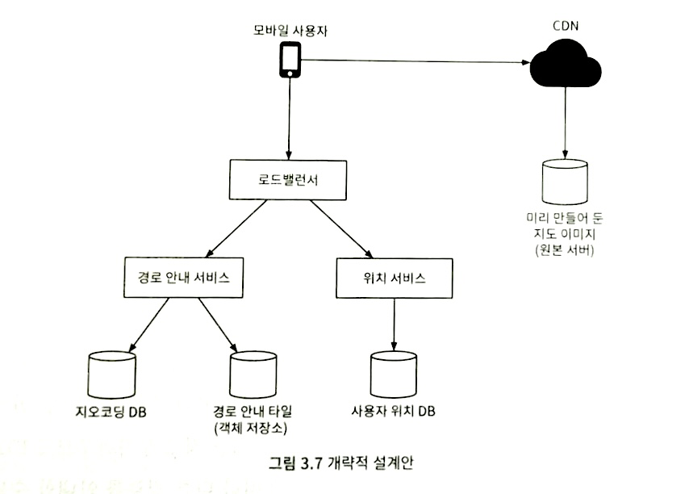

# 구글 맵

# 문제 이해 및 설계 범위 확정

### 기능 요구사항

1. 주 단말은 스마트폰
2. 사용자 위치 갱신
3. 경로 안내 서비스(ETA 서비스 포함)
4. 지도 표시

### 비기능 요구사항

1. 정확도
    - 사용자에게 잘못된 경로를 안내하면 안 됨
2. 부드러운 경로 표시
    - 클라이언트를 통해 제공되는 경로 안내 용도의 지도는 화면에 아주 부드럽게 표시되고 갱신되어야 함
3. 데이터 및 배터리 사용량
    - 클라이언트는 가능한 한 최소한의 데이터와 배터리를 사용해야 함
    - 모바일 단말에 아주 중요한 요구사항
4. 일반적으로 널리 통용되는 가용성 및 규모 확장성 요구사항

### 미리 숙지해야 할 기본 개념 및 용어

## **지도 101**

**측위 시스템**

- 이 세계는 축을 중심으로 회전하는 구
- 구 표면 상의 위치를 표현하는 체계
- 위경도 기반 측위 시스템
    - 최상단 = 북극
    - 최하단 = 남극
    - 위도 = 주어진 위치가 얼마나 북쪽/남쪽인지
    - 경도 = 얼마나 동쪽/서쪽인지

**3차원 위치의 2차원 변환**

- 지도 투영법(도법)
    - 3차원 구 위의 위치를 2차원 평면에 대승시키는 절차
- 거의 모든 투영법은 실제 지형의 기하학적 특성을 왜곡한다는 공통점을 갖고 있음
- 웹 메르카토르
    - 메르카토르 도법을 조금 변경한 법
    - 구글 맵이 사용하고 있음

**지오코딩**

- 주소를 지리적 측위 시스템의 좌표로 변환하는 프로세스
- ex) 미국 내 주소 ‘1600 Amphitheatre Parkway, Mountain View, CA’
    - 위도 37.423021
    - 경도 -122.083739
- 인터폴레이션(interpolation)
    - 지오코딩을 수행하는 방법 중 하나
    - GIS와 같은 다양한 시스템이 제공하는 데이터를 결합한다는 뜻

**지오해싱**

- 지도 위 특정 영역을 영문자와 숫자로 구성된 짧은 문자열에 대응시키는 인코딩 체계
- 2차원의 평면 공간으로 표현된 지리적 영역 위의 격자를 더 작은 격자로 재귀적으로 분할해 나감
- 1장에서 다뤘던 내용

**지도 표시**

- 지도를 화면에 표시하는 방법은 여기서 상세히 다루지 않을 것
- 타일
    - 지도를 화면에 표시하는데 가장 기본적인 개념
    - 지도 전부를 하나의 이미지로 표시하는 대신, 작은 타일로 쪼개어 표시
    - 클라이언트는 사용자가 보려는 영역에 관계된 타일만 다운받아 모자이크처럼 이어 붙인 다음 화면에 뿌림
    - 지도의 확대 수준에 따라 다른 종류의 타일을 준비해야 함

**경로 안내 알고리즘을 위한 도로 데이터 처리**

- 대부분의 경로 탐색 알고리즘 = 데이크스트라 알고리즘이나 A* 경로 탐색 알고리즘의 변종
    - 최적의 알고리즘을 정하는 것은 어려운 문제임
- 모든 경로 탐색 알고리즘은 교차로를 노드로, 도로는 노드를 잇는 선으로 표현하는 그래프 자료 구조를 가정함
- 대부분의 경로 탐색 알고리즘의 성능은 그래프 크기에 아주 민감함
    - 전 세계 도로망을 하나의 그래프로 표현하면 메모리도 많이 필요하고, 성능도 별로
    - 그래프를 관리 가능 단위로 분할할 필요가 있음
- 전 세계 도로망을 더 작은 단위로 분할하는 방법 = 지도 표시에 사용하는 타일 기반 분할법과 유사
    - 지오해싱과 비슷한 분할 기술을 적용하여 세계를 작은 격자로 나눔
    - 격자 안의 도로망을 노드(교차로)와 선(도로)으로 구성된 그래프 자료 구조로 변환
    - 각 격자 = 경로 안내 타일
    - 각 타일은 경로 탐색 알고리즘이 연결된 타일들을 지나갈 때 보일 더 큰 도로만 그래프를 만들기 위해 도로로 연결된 다른 타일에 대한 참조를 유지함
- 도로망을 언제든 불러올 수 있는 경로 안내 타일로 분할하면 좋은 점
    - 경로 탐색 알고리즘이 동작하는 데 필요한 메모리 요구량을 낮출 수 있음
    - 한 번에 처리해야 하는 경로의 양이 줄어듦
    - 필요한 만큼만 호출해서 처리하면 되기 때문에 성능이 좋아짐

**계층적 경로 안내 타일**

- 경로 안내가 효과적으로 동작하려면 필요한 수준의 구체성을 갖춘 도로 데이터가 필요함
- 보통은 구체성 정도를 상, 중, 하로 구분하여 세 가지 종류의 경로 안내 타일을 준비함
    - 상
        - 가장 구체성이 높은 타일
        - 크기가 아주 작음
        - 지방도 데이터만 두고 있음
    - 중
        - 규모가 비교적 큰 관할수를 잇는 간선 도로 데이터만 두고 있음
    - 하
        - 구체성이 가장 낮은 타일
        - 큰 영역을 커버
        - 도시와 주를 연결하는 주요 고속도로 데이터만 두고 있음

### 개략적 규모 추정

<aside>
💡 1피트 = 0.3048 미터
1킬로미터(km) = 0.6214마일
1킬로미터(km) = 1,000미터

</aside>

**저장소 사용량**

1. 세계 지도
    - 지원하는 확대 수준별로 지도 타일을 한 벌씩 두어야 함
    - 타일 전부를 보관하는 데 필요한 용량을 구하기 위해서는?
        - 최대 확대 수준(=지도를 최대한 확대하여 보는 데 필요한 타일 개수)을 따져보면 좋음
        - 지도를 확대할 때마다 하나의 타일을 네 장의 타일로 펼친다고 가정
        - 세계 지도를 21번 확대하여 볼 수 있으려면 최대 확대 수준을 대상으로 하였을 때 약 4.4조개의 타일이 필요함
        - 한 장의 타일 = 256 * 256 픽셀 압축 PNG 파일 = 100KB 저장 공간
        - 최대 확대 시 필요 타일을 전부 저장할 때 필요한 공간 = 4.4조 * 100KB = 400PB(페타바이트)
    - 보수적으로 보면 80~90% 가량의 저장 용량 절감 가능 = 44~88PB = 대략적으로 50PB
    - 확대 수준이 1 떨어질 때마다 필요한 타일 수는 1/4로 줄어듦
    - 다양한 확대 수준으로 지도를 표시한기 위해 대략 100PB 정도 소요됨
        - 50 + 50/4 + 50/16 + 50/64 + … = ~67PB
2. 메타데이터(metadata)
    - 각 지도 타일의 메타데이터는 크기가 아주 작아서 무시해도 지장이 없을 정도
    - 추정에서 제외
3. 도로 정보
    - 외부에서 받은 수 TB 용량의 도로 데이터를 보유하고 있음
    - 이 데이터를 경로 안내 타일로 변환해야 함
    - 변환 결과의 용량도 비슷할 것

**서버 대역폭**

- 서버가 처리해야 하는 일
    1. 경로 안내 요청
        - 클라이언트가 경로 안내 세션을 시작할 때 전송하는 메시지
    2. 위치 갱신 요청
        - 클라이언트가 경로 안내를 진행하는 동안 변경된 사용자 위치를 전송하는 메시지
        - 구글 맵 제품을 구성하는 서비스는 이 위치 정보를 다양한 방식으로 이용함
            - 실시간 교통 상황 데이터 계산
            - 상세 설계에서 더 자세하게
- 가정
    - DAU = 10억
    - 각 사용자는 경로 안내 기능을 평균적으로 주당 35분 사용 = 주당 350억 분 = 하루에 50억 분
- GPS 좌표를 매초 전송
    - 하루에 3000억 건(50억 분 * 60)의 요청 = 3백만 QPS
    - 클라이언트가 매초 새로운 GPS 좌표를 보낼 필요가 없을 수도 있음 = QPS 낮추기 가능
    - 얼마나 자주 보낼지는 사용자의 이동 속도 등 다양한 요건에 좌우됨
    - 본 설계안에서는 위치 변경 내역을 모아두었다가 15초마다 한 번씩 서버로 보낼 것 = QPS 20만
    - 최대 QPS는 평균치의 다섯 배 가량으로 가정

⇒ 위치 정보 갱신 요청 최대 QPS = 200,00 * 5 = 1백만

# 개략적 설계안 제시 및 동의 구하기

**개략적 설계안**



## 위치 서비스

**사용자의 위치를 기록**하는 역할을 담당

**주기적으로 위치 정보를 전송하면 좋은 점(t초마다 자기 위치를 전송한다고 가정)**

1. 해당 데이터 스트림을 활용하여 시스템 개선 가능
    - 실시간 교통 상황을 모니터링하는 용도
    - 새로 만들어진 도로나 폐쇄된 도로를 탐지 가능
    - 사용자 행동 양태를 분석하여 개인화된 경험 제공에 활용
2. 클라이언트가 보내는 위치 정보가 거의 실시간 정보에 가깝기 때문에 ETA를 좀 더 정확하게 선출 가능
3. 교통 상황에 따라 다른 경로 안내 가능

**사용자 위치가 바뀔 때마다 그 즉시 서버로 전송해야 할까? No!**

- 위치 이력을 클라이언트에 버퍼링해 두었다가 일괄 요청하여 전송 빈도 줄이기 가능
- n초마다 한 번씩 보내도록 설정하여 요청의 양 줄이기

**위치 갱신 요청 빈도를 줄여도 여전히 많은 쓰기 요청을 처리해야 함**

- 카산드라 DB
    - 아주 높은 쓰기 요청 빈도에 최적화되어 있음
    - 규모 확장이 용이함
- 카프카
    - 스트림 처리 엔진
    - 위치 데이터 로깅

**통신 프로토콜**

- HTTP를 keep-alive 옵션과 함께 사용하면 효율을 높일 수 있음

## 경로 안내 서비스

A에서 B 지점으로 가는 합리적으로 빠른 경로를 찾아 주는 역할을 담당

**요구사항**

- 결과를 얻는 데 드는 시간 지연은 어느 정도 감내 가능
- 계산된 경로는 최단 시간 경로일 필요는 없으나 정확도는 보장되어야 함

**경로 안내 요청 API**

- 사용자가 보낸 경로 안내 HTTP 요청은 로드밸런서를 거쳐 서비스에 도착
- 출발지와 목적지가 인자로 전달됨
- return 값
    
    ```json
    {
    	"distance": {"text":"0.2mi", "value":259},
    	"duration": {"text":"1 min", "value":83},
    	.
    	.
    	.
    	.
    	"geocoded_waypoints":[
    		{
    			"geocoder_status":"OK",
    			"paratial_match":true,
    			.
    			.
    		},
    		{
    			"geocoder_status":"OK",
    			.
    			.
    			.
    		}
    	],
    	"travel_mode": "DRIVING"
    }
    ```
    
- 경로 재탐색이나 교통 상황 변화 같은 문제는 적응형 ETA를 통해 해결 가능

## 지도 표시

확대 수준별로 한벌씩 지도 타일을 저장하려면 수백 PB가 필요하고, 그 모두를 클라이언트가 가지고 있는 방법은 실용적인 방법이 아님

클라이언트의 위치 및 현재 클라이언트가 보는 확대 수준에 따라 필요한 타일을 서버에서 가져오는 접근법이 바람직

**클라이언트는 언제 지도 타일을 서버에서 가져오는가?**

1. 사용자가 지도를 확대 또는 이동시키며 주변을 탐색
2. 경로 안내가 진행되는 동안 사용자의 위치가 현재 지도 타일을 벗어나 인접한 타일로 이동함

**다량의 지도 타일 데이터를 서버에서 효과적으로 가져오는 방법**

1. 클라이언트의 위치, 현재 클라이언트가 보는 지도의 확대 수준에 근거하여 필요한 지도 타일을 즉석에서 만드는 방법
    - 사용자 위치 및 확대 수준의 조합은 무한하다는 점을 감안하면, 심각한 문제가 있음
        - 모든 지도 타일을 동적으로 만들어야 하는 서버 클러스터에 심각한 부하가 걸림
        - 캐시를 활용하기 어려움
2. 확대 수준별로 미리 만들어 둔 지도 타일을 클라이언트에 전달하는 방법
    - 각 지도 타일이 담당하는 지리적 영역
        - 지오해싱 같은 분할법을 사용해 만든 고정된 사각형 격자로 표현
        - 정적임
    - 클라이언트는 지도 타일이 필요할 경우 현재 확대 수준에 근거하여 필요한 지도 타일 집합을 결정하고, 각 위치를 지오해시 URL로 변환
    - 미리 만들어 둔 정적 이미지를 CDN을 통해 서비스하는 방법
        1. 모바일 단말 사용자가 CDN에 지도 타일 요청
        2. 해당 타일이 CDN을 통해 서비스된 적이 없는 경우, CDN은 원본 서버에서 해당 파일을 가져와 캐싱한 다음에 사용자에게 반환
        3. 해당 타일이 CDN을 통해 서비스된 적이 있는 경우, 캐싱된 사본을 반환함
    - 장점
        - 규모 확장에 용이
        - 성능 측면에서도 유리함
            - 사용자에게 가장 가까운 POP에서 파일을 서비스함
            - 정적이기 때문에 캐싱하기에도 적합

**경로 안내를 진행하는 동안 클라이언트가 일반적으로 필요로 할 데이터 양**

- 클라이언트 측 캐시는 고려하지 않았음
    - 사람들은 같은 길을 일상적으로 이용하는 경향이 있기 때문에 캐싱을 사용하면 데이터 사용량을 많이 줄일 수 있을 것
- 데이터 사용량
    - 사용자가  30km/h 속도로 이동 중
    - 한 이미지가 200m * 200m 영역을 표현하도록 확대하여 지도를 표시하고 있음
    - 이미지 하나는 256 * 256픽셀로 평균 이미지 크기는 100KB
    - 1km * 1km 영역을 표현 = 이미지 25장 = 25 * 100KB = 2.5MB
    - 시간당 75MB = 30 * 2.5MB = 분당 1.25MB
- CDN을 통해 서비스되는 트래픽 규모
    - 매일 50억 분 가량의 경로 안내를 처리 = 50억 * 1.25MB = 6.25PB/일
    - 초당 전송해야 하는 지도 데이터의 양 = 62,500MB = 6.25PB / 10^5
    - CND을 사용하면 이 지도 이미지는 전 세계에 흩어져 있는 POP를 통해 제공 = 200개
    - 각 POP는 수백 MB 정도의 트래픽만 처리하면 될 것 = 62,500 / 200

**클라이언트는 CDN에서 지도 타일을 가져올 URL을 어떻게 결정할까?**

- 지도 타일 데이터를 서버에서 가져오는 두 번째 방법을 사용했다고 가정
- 지오해시를 사용해 격자를 나누기 때문에 모든 격자는 고유한 지오해시 값을 갖고 있음
    - 위도/경도로 표시된 클라이언트의 위치 및 현재 지도 확대 수준을 통해 화면에 표시할 지도 타일에 대응되는 지오해시를 쉽게 찾을 수 있음
    - 계산은 지도를 화면에 표시할 클라이언트가 수행
        - 지원해야 할 플랫폼이 많을 때 문제가 될 수 있음
        - 앞으로도 오랫동안 맵 타일 인코딩에는 지오해싱을 사용하리라는 보장이 있어야 함
    - 결과 값(지오해시)과 URL을 통해 CDN에서 지오 타일 조회 가능
- 주어진 위도/경도 및 확대 수준을 타일 URL로 변환하는 알고리즘을 별도의 서비스로 두기
    - 위도, 경도, 현재 확대 수준으로 받아 타일 URL을 생성하는 서비스
    - 운영 유연성이 높아짐
    - 사용자가 새로운 위치로 이동하거나 확대 수준을 변경하면 지도 타일 서비스가 어떤 타일이 필요한지 결정하여 해당 타일들을 가져오는 데 필요한 URL 집합을 계산함
        1. 모바일 사용자가 타일 URL들을 가져오기 위해 지도 타일 서비스를 호출함
        2. 해당 요청은 로드밸런서를 통해 지도 타일 서비스로 전달됨
        3. 지도 타일 서비스는 클라이언트의 위치와 확대 수준을 받아 9개(표시할 타일 하나와 8개의 주변 타일)의 타일 URL을 계산한 다음 클라이언트의 반환
        4. 모바일 클라이언트는 해당 타일을 CDN을 통해 다운로드

# 상세 설계

## 데이터 모델

1. 경로 안내 타일
    - 필요한 도로 데이터로는 외부 사업자나 기관이 제공한 것을 이용할 것
        - 해당 데이터의 용량은 수 테라바이트
        - 애플리케이션이 지속적으로 수집한 사용자 위치 데이터를 통해 끊임없이 개선됨
    - 방대한 양의 도로 및 그 메타데이터(이름, 관할구, 위도, 경도 등의 도로 부속 정보)로 구성됨
    - 그래프 자료 구조 형태로 가공되지 않은 데이터
        - 경로 안내 타일 처리 서비스를 주기적으로 실행하여 경로 안내 타일로 변환함
        - 도로 데이터에 발생한 새로운 변경사항을 반영하기 위해
    - 경로 안내 타일을 만들 때는 해상도를 달리하여 세 벌을 만듦
        - 각 타일에는 노드와 선분으로 표현된 해당 지역 내 교차로와 도로 정보가 들어있음
        - 다른 타일의 도로와 연결되는 경우에는 해당 타일에 대한 참조 정보도 포함
    - 경로 안내 알고리즘은 타일이 모인 결과로 만들어지는 도로망 데이터를 점진적으로 소비함
    - 경로 안내 타일 처리 서비스는 가공 결과로 만든 타일을 어디에 저장해야 할까?
        - 그래프 데이터는 메모리에 인접 리스트 형태로 저장하는 것이 일반적
        - 본 설계안이 다루는 타일 데이터는 메모리에 두기에 양이 너무 많음
            - 그래프의 노드와 선을 데이터베이스 레코드로 저장하는 것도 가능하겠지만 비용이 많이 듦
            - 경로 안내 타일의 경우 데이터베이스가 제공하는 기능이 필요 없음
        - S3 같은 객체 저장소에 파일을 보관하고 그 파일을 이용할 경로 안내 서비스에 적극적으로 캐싱하는 것이 본 설계안에 가장 효율적
            - 빠른 검색을 위해 타일을 객체 저장소에 보관할 때는 지오해시 기준으로 분류해 두는 것이 좋음
2. 사용자 위치
    - 도로 데이터 및 경로 안내 타일을 갱신하는 데 이용됨
    - 실시간 교통 상황 데이터나 교통 상황 이력 DB를 구축하는 데 활용됨
    - 데이터 스트림 프로세싱 서비스는 이 위치 데이터를 처리하여 지도 데이터를 갱신함
    - 엄청난 양의 쓰기 연산을 잘 처리할 수 있으면서, 수평적 규모 확장이 가능한 DB가 필요함
    
    ⇒ 카산드라 DB
    
3. 지오코딩 데이터
    - 주소를 위도/경도 쌍으로 변환하는 정보를 보관함
    - 출발지와 목적지 주소는 경로 계획 서비스에 전달하기 전에 이 데이터베이스를 통해 위도/경도 쌍으로 변환되어야 함
    - 빠른 읽기 연산을 제공하는 키-값 저장소가 적당함
        - 읽기 연산 빈번함
        - 쓰기 연산 드물게 발생
4. 미리 계산해 둔 지도 타일 데이터
    - 단말이 특정 영역의 지도를 요청하면 인근 도로 정보를 취함하여 모든 도로 및 관련 상세 정보가 포함된 이미지를 만들어 내야 함
    - 같은 이미지를 중복 요청하는 경우가 많기 때문에 캐싱 처리하는 것이 좋음
    - 지도 표시에 사용하는 확대 수준별로 미리 만들어 두고 CDN을 통해 전송
        - CDN 원본 서버는 아마존 S3와 같은 클라우드 저장소를 활용하는 것이 좋음

## 위치 서비스

~~데이터베이스 설계 및 사용자 위치 정보가 이용되는 방식에 초점을 맞춰서 상세 설계함~~

초당 백만 건의 위치 정보 업데이트가 발생한다는 점을 감안하면 쓰기 연산 지원에 탁월한 DB가 필요함

⇒ NoSQL 키-값 DB나 열-중심 DB가 적합

사용자 위치는 계속 변화함

변경되고 나면 이전 정보는 바로 무용해짐

데이터 일관성보다 데이터 가용성이 더 중요함

가용성과 분할 내성을 만족시키는 데 집중할 것

⇒ **카산드라 DB**

⇒ 높은 가용성을 보장하면서도 막대한 규모의 연산을 감당할 수 있도록 해줄 것

**DB 키 = (user_id, timestamp)**

- 해당 키에 매달리는 값으로 위도/경도 쌍을 저장
- user_id 파티션 키
    - 특정 사용자의 최근 위치를 신속하게 읽어 내기 위해서
    - 같은 파티션 키를 갖는 데이터는 함께 저장됨
        - 클러스터링 키 값에 따라 정렬
- timestamp 클러스터링 키

**사용자 위치 데이터는 어떻게 이용되는가**

사용자 위치를 데이터베이스에 기록하는 것과 별도로 카프카와 같은 메시지 큐에 로깅

개별 서비스는 카프카를 통해 전달되는 사용자 위치 데이터 스트림을 각자 용도에 맞게 활용함

ex) 실시간 교통 상황 서비스: 해당 스트림을 통해 읽은 데이터로 실시간 교통량 DB를 갱신

경로 안내 타일 처리 서비스: 해당 데이터를 활용해 새로 열린 도로나 폐쇄된 도로를 탐지

## 지도 표시

**지도 타일 사전 계산**

사용자가 보는 지도 크기나 확대 수준에 맞는 세부사항을 보여주기 위해 확대 수준별 지도 타일을 미리 만들어 둘 필요가 있음

구글 맵은 21단계로 지도 확대 가능

확대 수준 0 = 세계 전부를 256 * 256 픽셀 타일 하나로 표현

확대 수준 1 up = 전체 타일 수는 동서 방향으로 두 배, 남북 방향으로 두 배 늘어남

확대 수준 1 = 512 * 512 픽셀

확대 수준 2 = 1024 * 1024 픽셀

화면에 한 번에 표시 가능한 지도 타일 개수는 달라지지 않기 때문에 클라이언트는 해당 정보를 제공하기 위한 타일을 다운 받는 데 많은 네트워크 대역폭을 소진하지 않고도 클라이언트에 설정된 확대 수준에 최적인 크기의 지도를 표시할 수 있음

**최적화: 벡터 사용**

지도 표시에 WebGL 기술을 채택하면 좋은 점

네트워크를 통해 이미지를 전송하는 대신 경로와 다각형 등의 벡터 정보를 보냄

클라이언트는 수신된 경로와 다각형 정보를 통해 지도를 그려내면 됨

벡터 타일의 장점

1. 이미지에 비해 월등한 압축률
    - 네트워크 대역폭을 많이 아낄 수 있음
2. 훨씬 매끄러운 지도 확대 경험
    - 래스터 방식 이미지를 사용하면 확대 수준을 높이는 순간 이미지가 늘어지고 픽셀이 도드라져 보임
    - 벡터 타일을 사용하면 각 요소 크기를 적절하게 조정할 수 있어 매끄러운 확대 경험 제공 가능

## 경로 안내 서비스

가장 빠른 경로를 안내하는 역할을 담당

**지오코딩 서비스**

주소를 위도와 경도 쌍으로 바꿔주는 서비스

주소의 표현 방식(장소 이름, 지번, …)이 다양하다는 점을 고려해야 함

경로 안내 서비스는 이 서비스를 호출하여 출발지와 목적지 주소를 위도/경도 쌍으로 변환한 뒤 다른 서비스 호출에 이용함

**경로 계획 서비스**

현재 교통 상황과 도로 상태에 입각하여 이동 시간 측면에서 최적화된 경로를 제안하는 역할을 담당

다른 서비스들과 통신하여 결과를 만들어 냄

**최단 경로 서비스**

출발지와 목적지의 위도/경도를 입력 받아 k개의 최단 경로를 반환하는 서비스

교통이나 도로 상황은 고려하지 않음

도로 구조에만 의존하여 계산을 수행하기 때문에 많이 바뀌지 않음 = 캐싱 활용하면 좋음

객체 저장소에 저장된 경로 안내 타일에 대해 A* 경로 탐색 알고리즘의 한 형태를 실행

1. 입력으로 출발지와 목적지의 경도/위도를 받음
2. 출발지 타일에서 시작하여 그래프 자료 구조를 탐색
    - 탐색 범위를 넓히는 과정에서 필요한 주변 타일은 객체 저장소에서 조회
    - 같은 지역의 다른 확대 수준 타일로도 연결이 존재할 수 있음에 유의
3. 최단 경로가 충분히 확보될 때까지 알고리즘은 검색 범위를 계속 확대해 나가면서 필요한 만큼 타일을 가져오는 작업 반복

**예상 도착 시간 서비스**

기계 학습을 활용해 현재 교통 상황 및 과거 이력에 근거하여 예상 도착 시간을 계산함

실시간 교통 상황 데이터만 필요한 게 아니라 앞으로 10~20분 뒤에 교통 상황이 어떻게 달라질지도 예측해야 함

알고리즘 차원에서 풀어야 할 문제

**순위 결정 서비스**

경로 계획서비스는 ETA 예상치를 구하고 나면 순위 결정 서비스에 관련 정보를 모두 전달하여 사용자가 정의한 필터링 조건을 적용함

ex) 유료 도로 제외, 고속도록 제외, …

필터링이 끝나고 남은 경로를 소유 시간 순으로 정렬하여 최단 시간 경로 k개를 경로 안내 서비스에 반환

**중요 정보 갱신 서비스들**

카프카 위치 데이터 스트림을 구독하고 있다가 중요 데이터를 비동기적으로 업데이트하여 그 상태를 항상 최신으로 유지하는 역할을 담당

ex) 실시간 교통 정보 데이터베이스, 경로 안내 타일, …

### **적응형 ETA와 경로 변경**

본 설계안에서는 적응형 ETA와 경로 변경을 허용하지 않고 있음

이 문제를 해결하려면 서버는 현재 경로 안내를  받고 있는 모든 사용자를 추적해야함

교통 상황이 달라질 때마다 각 사용자의 ETA를 변경해 주어야 함

⇒ 적응형 ETA와 경로 변경을 지원하려면 아래의 질문에 답할 수 있어야 함

1. 현재 경로 안내를 받고 있는 사용자는 어떻게 추적하나?
2. 수백만 경로 가운데 교통 상황 변화에 영향을 받는 경로와 사용자를 효율적으로 가려낼 방법은 무엇인가?

**간단하지만 효율적이지 않은 방법**

1. 사용자 user_1이 안내 받은 경로
    
    경로 안내 타일 r_1, r_2, r_3, …, r_7로 구성
    
2. 경로 안내 서비스를 받고 있는사용자와 그 경로 정보를 데이터베이스에 저장한다고 하면
    
    user_1: r_1, r_2, r_3, …, r_k
    
    user_2: r_4, r_6, r_9, …, r_n
    
    user_3: r_2, r_8, r_9, …, r_m
    
3. 경로 안내 타일 r_2에서 교통사고 발생
4. 어떤 사용자가 영향을 받는지 전수 조사
    
    user_1: r_1, r_2, r_3, …, r_k
    
    user_2: r_4, r_6, r_9, …, r_n
    
    user_3: r_2, r_8, r_9, …, r_m
    
    .
    
    .
    
    .
    
    user_n: …
    
5. 이 테이블에 보관된 레코드 수 n + 평균 길이 m일 때 교통 상황 변화에 영양 받는 모든 사용자 검색의 시간 복잡도 O(n * m)

**검색 속도를 더 높이는 방법**

1. 경로 안내를 받는 사용자 각각의 경로 안내 타일
2. 그 타일을 포함하는 상위 타일(확대 수준이 더 낮은 타일)
3. 그 상위 타일의 상위 타일

⇒ 출발지와 목적지가 모두 포함된 타일을 찾을 때까지 재귀적으로 더하여 보관

⇒ 어떤 타일의 교통 상황이 변했을 때 경로 안내 ETA가 달라지는 사용자 = 해당 사용자의 데이터베이스 레코드 마지막 타일에 그 타일이 속하는 사용자 = 시간 복잡도 O(n)

user_1, r_1, super(r_1), super(super(r_1)), …

**교통 상황이 개선되었을 때 해야 하는 일까지 해결해 주지는 않음**

경로 재설정이 가능하다는 사실을 감지하고 알리는 방법

⇒ 현재 경로 안내를 받는 사용자가 이용 가능한 경로의 ETA를 주기적으로 재계산하여 더 짧은 ETA를 갖는 경로가 발견되면 알리기

**전송 프로토콜**

안내 중에 경로의 상황이 변경될 수 있음 = 데이터를 모바일 클라이언트에 안정적으로 전송할 방법 필요

- 모바일 푸시
    - 보낼 수 있는 메시지 크기가 제한적이기 때문에 비추천
    - 웹 애플리케이션은 지원하지 않음
- 웹 소켓
    - 서버에 주는 부담이 크지 않음
    - 일반적으로 롱 폴링보다 좋은 방안으로 봄

⇒ 모바일 푸시 X, 롱 폴링 X

⇒ 웹 소켓 or SSE(서버 전송 이벤트)

⇒ 양방향 통신 = 패키지나 상품이 목적지에 가까워졌을 때는 실시간 양방향 통신이 필요한 경우도 존재

# 마무리

**핵심 기능**

- 위치 갱신
- ETA
- 경로 계획
- 지도 표시

**확장 기능**

- 중간 경유지 설정 기능
    - 어떤 순서로 방문해야 가장 빨리 경유할 수 있을지
    - 배달 서비스에 유용할 것

# 토론

**실제 구글 맵처럼 장소를 저장하고, 저장한 장소 주변에 가면 포인트가 보여지게 하려면 어떻게 해야 할까?**

- 장소를 저장할 DB 필요
- 지도 타일에 기록을 해야 할까?
    - 그러면 캐싱을 사용할 수 없겠지
    - 사용자마다 저장한 장소가 다르니까
- 지도 타일을 불러올 때 체크를 해야겠다
- DB에 저장할 때는 어떤 값을 저장하는 게 좋을까?
    - 지오해시를 저장해서 빠르게 조회할 수 있게 해야겠다
