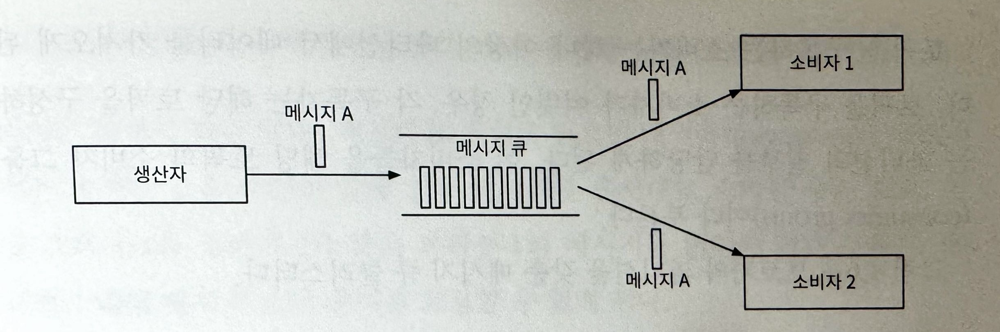

# 분산 메세지 큐

**메세지 큐를 사용하면 얻을 수 있는 이득**

- 결합도 완화
    - 컴포넌트 사이의 강한 결합이 사라지므로 각각을 독립적으로 갱신 가능
- 규모 확장성 개선
    - 데이터를 생산하는 생산자와 메시지를 소비하는 소비자 시스템 규모를 트래픽 부하에 맞게 독립적으로 늘릴 수 있음
    - ex) 트래픽이 많이 몰리는 시간에는 더 많은 소비자를 추가하여 처리 용량을 늘릴 수 있음
- 가용성 개선
    - 시스템의 특정 컴포넌트에 장애가 발생해도 다른 컴포넌트는 큐와 계속 상호작용을 이어갈 수 있음
- 성능 개선
    - 비동기 통신이 쉽게 가능함
    - 생산자는 응답을 기다리지 않고도 메세지를 보낼 수 있음
    - 소비자는 읽을 메시지가 있을 때만 해당 메시지를 소비하면 됨

**메세지 큐  vs 이벤트 스트리밍 플랫폼**

- 아파치 카프카나 펄사는 메시지 큐가 아니라 이벤트 스트리밍 플랫폼임
- 둘의 차이는 지원하는 기능이 서로 수렴하면서 점차 희미해짐
    - RabbitMQ는 옵션으로 제공되는 스트리밍 기능을 추가하면 메시지를 반복적으로 소비할 수 있는 동시에 데이터의 장기 보관도 가능함
- 본 설계안에서는 데이터 장기 보관, 메시지 반복소비 등의 부가 기능을 갖춘 분산 메시지 큐를 설계할 것

# 문제 이해 및 설계 범위 확정

**기능 요구사항**

1. 생산자는 메시지 큐에 메시지를 보낼 수 있어야 함
2. 소비자는 메시지 큐를 통해 메시지를 수신할 수 있어야 함
3. 메시지는 반복적으로 수신할 수도 있어야 함
4. 단 한 번만 수신하도록 설정 가능해야 함
5. 오래된 이력 데이터를 삭제될 수 있음
6. 메시지 크기는 킬로바이트 수준
7. 메시지가 생산된 순서대로 소비자에게 전달할 수 있어야 함
8. 메시지 전달 방식은 최소 한 번, 최대 한 번, 정확히 한 번 가운데 설정할 수 있어야 함

**비기능 요구사항**

1. 높은 대역폭과 낮은 전송 지연 가운데 하나를 설정으로 선택 가능하게 하는 기능
2. 규모 확장성
    - 메시지 양이 급증해도 처리 가능해야 함
3. 지속성 및 내구성
    - 데이터는 디스트에 지속적으로 보관되어야 하며 여러 노드에 복제되어야 함

**전통적 메시지 큐와 다른 점**

- 전통적인 메시지 큐는 이벤트 스트리밍에 비해 보관 문제를 중요하게 다루지 않음
- 전통적인 메시지 큐는 메시지가 소비자에게 전달되기 충분한 기간 동안만 메모리에 보관함
- 처리 용량을 넘어선 메시지는 디스크에 보관하긴 하지만 이벤트 스트리밍 플랫폼이 감당하는 용량보다는 아주 낮은 수준
- 전통적인 메시지 큐는 메시지 전달 순서도 보존하지 않음

⇒ 이런 차이를 감안하면 설계는 크게 단순해질 수 있음

⇒ 필요할 때만 그 점을 언급할 것

# 개략적 설계안 제시 및 동의 구하기

**큐의 기본 기능**

- 생산자는 메세지를 메시지 큐에 발행
- 소비자는 큐를 구독하고 구독한 메시지를 소비
- 메시지 큐는 생산다와 소비자 사이의 결합을 느슨하게 하는 서비스
    - 생산자와 소비자의 독립적인 운영 및 규모 확장을 가능하게 하는 역할
- 생산자와 소비자는 모두 클라이언트/서버 모델 관점에서 보면 클라이언트고 서버 역할을 하는 것은 메시지 큐이며 이 클라이언트와 서버는 네트워크를 통해 통신

**메세지 모델**

1. 일대일 모델
    - 전통적인 메시지 큐에서 흔히 발견되는 모델
    - 큐에 전송된 메시지는 오직 한 소비자만 가져갈 수 있음
        - 소비자가 아무리 많아도 각 메시지는 오직 한 소비자만 가져갈 수 있음
    - 어떤 소비자가 메시지를 가져갔다는 사실을 큐에 알리면 해당 메시지 큐에서 삭제됨
    - 데이터 보관을 지원하지 않음
2. 발행-구독 모델
    
    
    
    - 토픽
        - 메시지를 주제별로 정리하는 데 사용
        - 각 토픽은 메시지 큐 서비스 전반에 고유한 이름을 가짐
    - 메시지를 보내고 받을 때는 토픽에 보내고 받게 됨
    - 토픽에 전달된 메시지는 해당 토픽을 구독하는 모든 소비자에 전달됨
        - ex) 메시지 A는 소비자 1과 2 모두에 전달됨

⇒ 본 설계안이 제시할 분산 메시지 큐는 두 가지 모델을 전부 지원

**토픽, 파티션, 브로커**

- 토픽에 보관되는 데이터(메시지)의 양이 커져서 서버 한 대로 감당하기 힘든 상황을 해결하기 위해 샤딩 기법을 활용
- 토픽을 여러 파티션으로 분할하고, 메시지를 모든 파티션에 균등하게 나눠 보냄
    - 파티션 == 토픽에 보낼 메시지의 작은 부분집합
- 파티션을 유지하는 서버 == 브로커
- 파티션을 브로커에 분산 == 높은 규모 확장성을 달성하는 비결
    - 토픽의 용량을 확장하고 싶으면 파티션 개수를 늘리면 됨
- 각 토픽 파티션은 FIFO 큐처럼 동작
    - 같은 파티션 안에서는 베시지 순서가 유지됨
    - 파티션 내에서의 메시지 위치 = offset
- 생산자가 보낸 메시지는 해당 토픽의 파티션 가운데 하나로 보내짐
- 메시지에는 사용자 ID 같은 키를 붙일 수 있음
    - 같은 키를 가진 모든 메시지는 같은 파티션으로 보내짐
    - 키가 없는 메시지는 무작위로 선택된 파티션으로 전송
- 토픽을 구독하는 소비자는 하나 이상의 파티션에서 데이터를 가져오게 됨
    - 토픽을 구독하는 소비자가 여럿인 경우, 각 구독자는 해당 토픽을 구성하는 파티션의 일부를 담당하게 됨
    - 소비자들은 해당 토픽의 소비자 그룹이라고 부름

**소비자 그룹**

- 소비자 그룹 내 소비자는 토픽에서 메시지를 소비하기 위해 서로 협력함
- 하나의 소비자 그룹은 여러 토픽을 구독할 수 있고 offset을 별도로 관리함
- 같은 그룹 내의 소비자는 메시지를 병렬로 소비 가능
    1. 소비자 그룹1은 토픽 A를 구독
    2. 소비자 그룹2는 토픽 A와 토픽 B를 구독
    3. 토픽 A는 그룹1과 그룹2가 구독하므로 해당 토픽 내 메시지는 그룹1과 그룹2 내의 소비자에게 전달됨
    
    ⇒ 발행-구독 모델을 지원
    
- 데이터를 병렬로 읽으면 대역폭 측면에서는 좋지만 같은 파티션 안에 있는 메시지를 순서대로 소비할 수는 없음
    - 소비자1과 소비자2가 같은 파티션1의 메시지를 읽어야 할 때 파티션1 내의 메시지 소비 순서를 보장할 수 없게 됨
    - 어떤 파티션의 메시지는 한 그룹 안에서는 한 소비자만 읽을 수 있도록 제약사항을 추가하면 해결됨
        - 그룹 내 소비자의 수가 구독하는 토픽의 파티션 수보다 크면 어떤 소비자는 해당 토픽에서 데이터를 읽지 못하게 됨
        
        ⇒ 모든 소비자를 같은 소비자 그룹에 두면 같은 파티션의 메시지는 오직 한 소비자만 가져갈 수 있으므로 결국 일대일 모델에 수렴하게 됨
        
    - 파티션은 가장 작은 저장 단위이므로 미리 충분한 파티션을 할당해 두면 파티션의 수를  동적으로 늘리는 일은 피할 수 있음
    - 처리 용량을 늘리면 그냥 소비자를 더 추가하면 됨

**개략적 설계안**

- 클라이언트
    - 생산자
        - 메시지를 특정 토픽으로 보냄
    - 소비자 그룹
        - 토픽을 구독하고 메시지를 소비함
- 핵심 서비스 및 저장소
    - 브로커
        - 파티션들을 유지함
        - 하나의 파티션은 특정 토픽에 대한 메시지의 부분 집합을 유지함
    - 저장소
        - 데이터 저장소
            - 메시지는 파티션 내 데이터 저장소에 보관됨
        - 상태 저장소
            - 소비자 상태는 이 저장소에 유지됨
        - 메타 데이터 저장소
            - 토픽 설정, 속성 등은 이 저장소에 유지됨
    - 조정 서비스
        - 서비스 탐색
            - 어떤 브로커가 살아있는지 알려줌
        - 리더 선출
            - 브로커 가운데 하나는 컨트롤러 역할을 담당해야 함
            - 한 클러스터에는 반드시 활성 상태 컨트롤러가 하나 있어야 함
            - 해당 컨트롤러가 파티션 배치를 책임짐
        - 아파치 주키퍼나 etcd가 보통 컨트롤러 선출을 담당하는 컴포넌트로 널리 이용됨

# 상세 설계

- 회전 디스크의 높은 순차 탐색 성능과 현대적 운영체제가 제공하는 적극적 디스크 캐시 전략을 잘 이용하는 디스크 기반 자료 구조를 활용할 것
- 메시지가 생산자로부터 소비자에게 전달되는 순간까지 아무 수정 없이도 전송이 가능하도록 하는 메시지 자료 구조를 설계하고 활용할 것
    - 전송 데이터의 양이 막대한 경우에 메시지 복사에 드는 비용을 최소화하기 위함
- 일괄 처리를 우선하는 시스템을 설계할 것
    - 소규모의 I/O가 많으면 높은 대역폭을 지원하기 어렵기 때문에 일괄 처리를 장려함
    - 생산자는 메시지를 일괄 전송
    - 메시지 큐는 메시지들을 더 큰 단위로 묶어서 보관
    - 소비자도 가능하면 메시지를 일관 수신하도록

## 데이터 저장소

**메시지 큐의 트래픽 패턴**

- 읽기와 쓰기가 빈번하게 일어남
- 갱신/삭제 연산은 발생하지 않음
- 순차적인 읽기/쓰기가 대부분

**선택지**

1. 데이터베이스
    - 관계형 데이터베이스
        - 토픽별로 테이블 만들기
        - 토픽에 보내는 메시지는 해당 테이블에 새로운 레코드로 추가함
    - NoSQL 데이터베이스
        - 토픽별로 컬렉션 만들기
        - 토픽에 보내는 메세지는 하나의 문서가 됨
    
    ⇒ 요구사항은 맞출 수 있지만 이상적인 방법은 아님
    
    ⇒ 읽기 연산과 쓰기 연산이 동시에 대규모로 빈번하게 발생하는 상황을 잘 처리하는 데이터베이스는 설계하기 어려움
    
    ⇒ 시스템의 병목이 될 수 있음
    
2. 쓰기 우선 로그
    - WAL
        - 새로운 항목이 추가되기만 하는 일반 파일
        - MySQL 복구 로그, 아파치 주키퍼도 WAL을 사용하여 구현함
    - 지속성을 보장하는 메시지는 디스크에 WAL로 보관할 것을 추천함
        - 접근 패턴이 순차적일 때 디스크는 아주 좋은 성능을 보임
        - 회전식 디스크 기반 저장장치는 큰 용량을 저렴한 가격에 제공함
    - 새로운 메시지는 파티션 꼬리 부분에 추가됨
        - 오프셋은 그 결과로 점진적으로 증가함
        - 로그 파일 줄 번호를 오프셋으로 사용하는 것이 가장 쉬운 방법이지만 파일의 크기도 무한정 커질 수는 없기 때문에 세그먼트 단위로 나누는 것이 바람직
    - 세그먼트를 사용하는 경우 새 메시지는 활성 상태의 세그먼트 파일에만 추가됨
        - 세그먼트의 크기가 일정 한계에 도달하면 새 활성 세그먼트 파일이 만들어져 새로운 메시지를 수용
        - 종전까지 활성 상태였던 세그먼트 파일은 다른 나머지 세그먼트 파일처럼 비활성 상태로 바뀜
        - 비활성 세그먼트는 읽기 요청만 처리함
        - 낡은 비활성 세그먼트 파일은 보관 기한이 만료되거나 용량 한계에 도달하면 삭제 가능

**디스크 성능 관련 유의사항**

- 데이터 접근 패턴이 무작위일 때 회전식 디스크가 느려짐
- 순차적으로 데이터에 접근하면 좋은 성능으로 사용 가능
- 비용적인 문제도 해결 가능
- 디스크 캐시 기능도 추천

## 메시지 자료 구죠

**메시지 자료 구조**

- 높은 대역폭 달성의 중요한 부분
- 생산자, 메시지 큐, 소비자 사이의 계약

본 설계안에서는 메시지가 큐를 거쳐 소비자에게 전달되는 과정에서 불필요한 복사가 일어나지 않도록 함으로써 높은 대역폭을 달성할 것

**메시지 키**

- 파티션을 정할 때 사용됨
- 키가 주어지지 않은 메시지의 파티션은 무작위로 결정
- 키가 주어진 메시지의 파티션은 hash(key) % numPartitions 공식에 따라 결정됨
- 유연한 설계가 필요하다면 파티션 선정 메커니즘을 직접 정의 가능
- 키
    - 문자열 or 숫자
    - 비즈니스 관련 정보가 담기는 것이 보통
- 파티션
    - 파티션 번호는 메시지 큐 내부적으로 사용되는 개념이기 때문에 클라이언트에 노출하면 안됨
    - 키를 파티션에 대응시키는 알고리즘을 적절히 정의해 높으면 파티션의 수가 달라져도 모든 파티션에 메시지가 계속 균등히 분산 가능

**메시지 값**

- 메시지의 내용
- 페이로드
- 일반 테스트 or 압축된 이진 블록

**메시지의 기타 필드**

- 토픽
- 파티션
- 오프셋
    - 파티션 내 메시지의 위치
- 타임스탬프
- 크기
- CRC
    - 순환 중복 검사
    - 주어진 데이터의 무결성을 보장하는 데 이용됨

## 일괄 처리

**일괄 처리가 성능 개선에 중요한 이유**

- 운영체제로 하여금 여러 메시지를 한 번의 네트워크 요청으로 전송할 수 있도록 하기 때문에 값비싼 네트워크 왕복 비용 제거 가능
- 브로커가 여러 메시지를 한 번에 로그에 기록하면 더 큰 규모의 순처 쓰기 연산이 발생하고 운영체제가 관리하는 디스크 캐시에서 더 큰 규모의 연속된 공간을 점유하게 됨
    
    ⇒ 더 높은 디스크 접근 대역폭을 달성할 수 있음
    

**높은 대역폭 + 낮은 응답 지연을 달성하기는 어려움**

- 시스템이 낮은 응답 지연이 중요한 전통적 메시지 큐로 이용된다면 일괄 처리 메시지 양은 낮춤
    - 디스크 성능은 다소 낮아짐
- 처리량을 높여야 한다면 토픽당 파티션의 수는 늘림
    - 낮아진 순차 쓰기 연산 대역폭을 벌충할 수 있음

## 생산자, 소비자 측 작업 흐름

### **생산자 측 작업 흐름**

1. 생산자는 메시지를 라우팅 계층으로 보냄
2. 라우팅 계층은 메타데이터 저장소에서 사본 분산 계획을 읽어 캐시에 보관
3. 메시지가 도착하면 라우팅 계층은 파티션 1의 리더 사본(= 브로커 1)에 보냄
4. 리더 사본이 우선 메시지를 받고 해당 리더를 따르는 다른 사본은 해당 리더로부터 데이터를 받음
5. 충분한 수의 사본이 동기화되면 리더는 디스크에 기록함
    
    ⇒ 데이터가 소비 가능한 상태 되는 시점
    
6. 기록이 끝나면 생산자에게 회신을 보냄

**리더와 사본이 필요한 이유는 무엇인가?**

- 장애 감내가 가능한 시스템을 만들기 위해서
- 사본 동기화 절에서 더 자세하게

**단점**

- 라우팅 계층을 도입하면 거쳐야 할 네트워크 노드가 하나 더 늘어나기 때문에 오버헤드가 발생하여 네트워크 지연이 늘어남
- 일괄 처리가 가능하면 효율을 많이 높일 수 있는데 그런 부분이 고려되지 않음

**수정한 설계안**

- 라우팅 계층을 생산자 내부로 편입
- 버퍼를 도입
- 생산자 클라이언트 라이브러리의 일부로 생산자에 설치
- 장점
    - 네트워크를 거칠 필요가 줄어들기 때문에 전송 지연도 줄어듦
    - 생산자는 메시지를 어느 파티션에 보낼지 결정하는 자신만의 로직을 가질 수 있음
    - 전송할 메시지를 버퍼 메모리에 보관했다가 목적지로 일괄 전송하여 대역폭을 높일수 있음

**얼마나 많은 메시지를 일괄 처리하는 것이 좋을까?**

= 대역폭과 응답 지연 사이에서 타협점을 찾는 것

- 일괄 처리할 메시지의 양을 늘리면 대역폭은 늘어나지만 응답 속도는 느려짐
    - 일괄 처리가 가능할 양의 메시지가 쌓이길 기다려야 하기 때문
- 양을 줄이면 메시지는 더 빨리 보낼 수 있기 때문에 지연은 줄어들지만 대역폭은 손해를 봄

⇒ 생산자는 메시지 큐의 용도를 감안하여 일괄 처리 메시지 양을 조정해야 함

### **소비자 측 작업 흐름**

특정 파티션의 오프셋을 주고 해당 위치에서부터 이벤트를 묶어 가져옴

## 푸시 vs 풀

**푸시 모델**

- 장점
    - 낮은 지연
        - 브로커는 메시지를 받는 즉시 소비자에게 보낼 수 있음
- 단점
    - 소비자가 메시지를 처리하는 속도가 생산자가 메시지를 만드는 속도보다 느리면 소비자에게 큰 부하가 걸릴 가능성이 있음
    - 생산자가 데이터 전송 속도를 좌우하기 때문에 소비자는 항상 그에 맞는 처리가 가능한 컴퓨팅 자원을 준비해 두어야 함

**풀 모델**

- 장점
    - 메시지를 소비하는 속도를 소비자가 알아서 결정 가능
        - 어떤 소비자는 메시지를 실시간으로 가져가고 어떤 소비자는 일괄로 가져가능 등의 구성이 가능
    - 메시지를 소비하는 속도가 생산 속도보다 느려지면 소비자를 늘려 해결 가능
        - 생산 속도를 따라잡을 때까지 기다려도 됨
    - 일괄 처리에 적합
        - 소비자는 지난번 마지막으로 가져간 로그 위치 다음에 오는 모든 메시지 또는 설정된 최대 개수 만큼을 한 번에 가져갈 수 있음
- 단점
    - 브로커에 메시지가 없어도 소비자는 계속 데이터를 끌어가려는 시도를 할 것이기 때문에 소비자 측 컴퓨팅 자원이 낭비됨
        - 이 문제를 극복하기 위해 많은 메시지 큐가 롱 폴링 모드를 지원함
        - 당장을 가져갈 메시지가 없더라도 일정 시간은 기다리도록 하기 위해

⇒ 대부분의 메시지 큐는 풀 모델을 지원함

**풀 모델 동작 흐름**

그룹1에 합류하고 토픽A를 구독하길 원하는 새로운 소비자

1. 그룹 이름을 해싱하여 접속할 브로커 노드를 찾음
    - 같은 그룹의 모든 소비자는 같은 브로커에 접속
    - 이런 브로커 == 해당 소비자 그룹의 코디네이터
2. 코디네이터는 해당 소비자를 그룹에 참여시키고 파티션2를 해당 소비자에 할당
3. 소비자는 마지막으로 소비한 오프셋 이후 메시지를 가져옴
    - 오프셋 정보는 상태 저장소에 있음
4. 소비자는 메시지를 처리하고 새로운 오프셋을 브로커에 보냄

## 소비자 재조정

어떤 파티션을 책임지는지 다시 정하는 프로세스

**소비자 재조정이 시작되는 경우**

- 새로운 소비자가 합류
- 기존 소비자가 그룹을 떠남
- 어떤 소비자에 장애가 발생
- 파티션 조정

**코디네이터**

- 소비자 재조정 과정에서 중요한 역할
- 소비자 재조정을 위해 소비자들과 통신하는 브로커 노드
- 소비자로부터 오는 박동 메시지를 살피고 소비자의 파티션 내 오프셋 정보를 관리

**코디네이터와 소비자가 상호작용하는 방법**

- 각 소비자는 특정 그룹에 속함
    - 해당 그룹 전담 코디네이터는 그룹 이름을 해싱하면 찾을 수 있음
    - 같은 그룹의 모든 소비자는 같은 코디네이터에 연결
- 코디네이터는 자신에 연결한 소비자 목록을 유지
    - 목록에 변화가 생기면 코디네이터는 해당 그룹의 새 리더를 선출
- 새 리더는 새 파티션 배치 계획을 만들고 코디네이터에게 전달
    - 코디네이터는 해당 계획을 그룹 내 다른 모든 소비자에게 알림

**장애 발생**

- 소비자는 네트워크 이슈를 비롯한 다양한 장애를 겪을 수 있음
- 코디네이터 관점에서 소비자에게 발생한 장애는 박동 신호가 사라지는 현상을 통해 감지 가능
- 소비자 장애를 감지하면 코디네이터는 재조정 프로세스를 시작하여 파티션을 재배치함

**새로운 소비자가 그룹에 합류한 경우의 처리 흐름**

1. 시작 시점에서는 그룹 안에 소비자 A만 존재함
2. 소비자 A는 모든 파티션의 메시지를 소비하며 코디네이터에게 지속적으로 박동메시지를 전송
3. 소비자 B가 그룹 합류 요청
4. 코디네이터가 소비자 재조정이 필요한 시점이라고 판단하고 모든 소비자에게 그 사실을 수동적으로 통지
    - 소비자 A의 박동 메시지가 왔을 때 그 응답으로 그룹에 다시 합류하라고 알림
5. 리더는 파티션 배치 계획을 생성한 다음 코디네이터에게 전송
6. 리더 외의 소비자는 코디네이터에게 요청하여 파티션 배치 계획을 받아옴
7. 소비자는 자신에게 배치된 파티션에서 메시지를 가져오기 시작

**기존 소비자가 그룹을 떠나는 과정에 대한 처리 흐름**

1. 소비자 A와 B는 같은 소비자 그룹 멤버
2. 소비자 A가 가동 중단이 필요하여 그룹 탈퇴를 요청
3. 코디네이터는 소비자 재조정이 필요한 시점으로 판단하고 소비자 B의 박동 메시지를 수신하면 그룹에 다시 합류할 것
4. 나머지 절차는 앞에서 이야기한 것과 거의 동일

**소비자가 비정상적으로 가동을 중단한 경우에 대한 처리 흐름**

1. 소비자 A와 B는 같은 소비자 그룹 멤버이고 지속적으로 코디네이터에게 박동 메시지를 전송
2. 소비자 A에 장애가 발생하면 더 이상의 박동 메시지는 코디네이터에게 전달되지 못함
3. 코디네이터는 일정 시간 동안 해당 상황이 지속되면 해당 소비자가 사라진 것으로 판탄
4. 코디네이터는 소비자 재조정 프로세스를 개시
5. 나머지 절차는 앞에서 이야기한 것과 거의 동일

## 상태 저장소

**상태 저장소에 저장되는 정보**

- 소비자에 대한 파티션의 배치 관계
- 각 소비자 그룹의 각 파티션에서 마지막으로 가져간 메시지의 오프셋

**소비자 상태 정보 데이터가 이용되는 패턴**

- 읽기와 쓰기가 빈번하게 발생하지만 양은 많지 않음
- 데이터 갱신은 빈번하게 일어나지만 삭제되는 일은 거의 없음
- 읽기와 쓰기 연산은 무작위적 패턴을 보임
- 데이터의 일관성이 중요

**적합한 저장소 기술**

- 데이터 일관성 및 높은 읽기/쓰기 속도에 대한 요구사항을 고려해야 함

⇒ 주키퍼 같은 키-값 저장소를 사용하는 것이 바람직

## 메타데이터 저장소

- 토픽 설정이나 속성 정보를 보관
    - 파티션 수
    - 메시지 보관 기간
    - 사본 재치 정보
- 자주 변경되니 않음
- 양이 적음
- 높은 일관성을 요구함

⇒ 이러한 데이터의 보관에는 **주키퍼**가 적절함(~~주키퍼 앞광고?)~~

## 주키퍼

계층적 키-값 저장소 기능을 제공

분산 시스템에 필수적인 서비스

⇒ 주키퍼는 분산 메시지 큐를 설계하는 데 아주 유용함

**주키퍼를 사용하여 설계를 단순화**

- 메타데이터와 상태 저장소는 주키퍼를 이용하여 구현
- 브로커는 이제 메시지 데이터 저장소만 유지하면 됨
- 주키퍼가 브로커 클러스트의 리더 선출 과정을 도움

## 복제

- 분산 시스템에서 하드웨어 장애는 흔한 일
- 디스크에 손상이나 영구적 장애가 발생하면 데이터는 사라짐

⇒ 이런 문제를 해결하고 높은 가용성을 보장하기 위해 복제를 사용

- 각 파티션은 3개의 사본을 갖고 있음
    - 사본들은 서로 다른 브로커 노드에 분산
- 짙은 색으로 강조한 사본은 해당 파티션의 리더
    - 나머지는 단순 사본
- 생산자는 파티션에 메시지를 보낼 때 리더에게만 보냄
- 메시지를 완전히 동기화한 사본의 개수가 지정된 임계값을 넘으면 리더는 생산자에게 메시지를 잘 받았다는 응답을 보냄

**사본 분산 계획**

- 토픽 A의 파티션 1
    - 사본 3개
    - 리더는 브로커 1
    - 단순 사본은 브로커 2, 3
- 토픽 A의 파티션 2
    - 사본 3개
    - 리더는 브로커 2
    - 단순 사본은 브로커 3, 4
- 토픽 B의 파티션 1
    - 사본 3개
    - 리더는 브로커 3
    - 단순 사본은 브로커 4, 1

**사본 분산 계획은 누가 어떻게 만드는가?**

- 조정 서비스의 도움으로 브로커 노드 가운데 하나가 리더로 선출되면 해당 리더 브러커 노드가 사본 분산 계획을 만들고 메타데이터 저장소에 보관
- 다른 모든 브로커는 해당 계획대로 움직이면 됨

## 사본 동기화

- 장애로 인한 메시지 손실을 막기 위해 메시지를 여러 파티션에 두고 그 파티견을 다시 여러 사본으로 복제함
- 메시지는 리더로만 보내고 다른 단순 사본은 리더에게 메시지를 가져가 동기화함

⇒ 그 모두를 어떻게 동기화 시킬 것인가?

**동기화된 사본(ISR)**

- 리더 + 동기화된 사본
- 동기화되었다
    - 토픽의 설정에 따라 달라짐
    - 만약 replica.lag.max.meffages의 값이 4일 경우
        - 단순 사본에 보관된 메시지 개수와 리더 사이의 차이가 3이라면 해당 사본은 여전히 ISR
        - 리더는 항상 ISR 상태

**ISR 동작법**

- 리더 사본의 합의 오프셋 값 = 13
    - 리더에 두 개의 새로운 메시지가 기록되었지만 사본 간에 합의가 이루어진 것은 아님
    - 합의 오프셋이 의미하는 바는, 이 오프셋 이전에 기록된 모든 메시지는 이미 IRS 집합 내 모든 사본에 동기화가 끝났다는 것
- 사본 2와 사본 3은 이미 리더 상태를 동기화하여 ISR이 되었기 때문에 새로운 메시지를 가져올 수 있음
- 사본 4는 리더 상태를 충분히 따라잡지 못하였기 때문에 아직 ISR이 아님

**ISR이 필요한 이유**

- 성능과 영속성 사이의 타협점

**메시지 수신 응답 설정**

- ACK=all
    - 생산자는 모든 ISR이 메시지를 수신한 뒤에 ACK 응답을 받음
    - 가장 느린 ISR의 응답을 기다려야 하기 때문에 메시지를 보내기 위한 시간이 길어짐
    - 영속성 측면에서는 가장 좋은 구성
- ACK=1
    - 생산자는 리더가 메시지를 저장하고 나면 바로 ACK 응답을 받음
    - 데이터가 동기화될 때까지 기다리지 않으니 응답 지연은 개선됨
    - 메시지 ACK를 보낸 직후 리더에 장애가 생기면 해당 메시지는 다른 사본에 반영되지 못하였으므로 복구할 길 없이 소실됨
    - 데이터가 사라져도 상관없는 대신 낮은 응답 지연을 보장해야 하는 시스템에 적합
- ACK=0
    - 생산자는 보낸 메시지에 대한 수신 확인 메시지를 기다리지 않고 계속 메시지를 전송하여 어떤 재시도도 하지 않음
    - 낮은 응답 지연을 달성하기 위해 메시지 손실은 감소하는 구성
    - 지표 수집이나 데이터 로깅처럼 처리해야 하는 메시지의 양이 많고 때로 데이터 손실이 발생해도 상관 없는 경우에 좋음

**가장 쉬운 구성 = 소비자로 하여금 리더에게 메시지를 읽어가도록 하기**

**ISR 요건을 만족하는 사본에서 메시지를 가져가지 않은 이유**

- 설계 및 운영이 단순함
- 특정 파티션의 메시지는 같은 소비자 그룹 안에서 오직 한 소비자만 읽어 갈 수 있기 때문에 리더 사본에 대한 연결이 많지 않음
- 아주 인기 있는 토픽이 아니라면 리더 사본에 대한 연결의 수는 많지 않음
- 아주 인기 있는 토픽의 경우에는 파티션이나 소비자 수를 늘려 규모를 확장하면 됨

**어떤 사본이 ISR인지 아닌지 판별하는 방법**

- 보통 각 파티션 담당 리더는 자기 사본들이 어느 메시지까지 가져갔는지 추적하여 ISR 목록을 관리함

## 규모 확장성

### 생산자

- 소비자에 비해 개념적으로 훨씬 간단함
- 그룹 단위의 조정에 가담할 필요가 없음
- 새로운 생산자를 추가하거나 삭제함으로써 규모 확장성 달성 가능

### 소비자

- 소비자 그룹은 서로 독립적이기 때문에 새 소비자 그룹은 쉽게 추가하고 삭제 가능
- 같은 소비자 그룹 내의 소비자가 새로 추가/삭제되거나 장애로 제거되어야 하는 경우에는 재조정 메커니즘이 맡아 처리함

⇒ 소비자 측의 규모 확장성과 결함 내성을 보장하는 것

### 브로커

**브로커 노드의 장애 복구**

1. 4개의 브로커가 있음
    - 토픽 A의 파티션 1
        - 사본은 각각 브로커 1(리더), 2, 3
    - 토픽 A의 파티션 2
        - 사본은 각각 브로커 2(리더), 3, 4
    - 토픽 B의 파티션 1
        - 사본은 각각 브로커 3(리더), 4, 1
2. 브로커 3에 장애가 발생하여 해당 노드의 모든 파티션이 손실됨
    - 토픽 A의 파티션 1
        - 사본은 각각 브로커 1(리더), 2
    - 토픽 A의 파티션 2
        - 사본은 각각 브로커 2(리더), 4
    - 토픽 B의 파티션 1
        - 사본은 각각 브로커 4(리더), 1
3. 브로커 컨트롤러는 브로커 3이 사라졌음을 감지함
    - 토픽 A의 파티션 1
        - 사본은 각각 브로커 1(리더), 2, 4(신규)
    - 토픽 A의 파티션 2
        - 사본은 각각 브로커 2(리더), 4, 1(신규)
    - 토픽 B의 파티션 1
        - 사본은 각각 브로커 4(리더), 1, 2(신규)
4. 새로 추가된 사본은 단순 사본으로 리더에 보관된 메시지를 따라잡는 동작을 개시

**브로커의 결함 내성을 높이기 위해 고려해야 할 사항**

- 메시지가 성공적으로 합의 되었다고 판단하려면 얼마나 많은 사본에 메시지가 반영되어야 할까?
    - 수치가 높으면 높을수록 안전함
    - 응답 지연과 안전성 사이의 균형을 찾을 필요가 있음
- 파티션의 모든 사본이 같은 브로커 노드에 있으면 해당 노드에 장애가  발생할 경우 해당 파티션은 완전히 소실될 것
    - 사본과 같은 노드에 두면 안됨
- 파티션의 모든 사본에 문제가 생기면 해당 파티션의 데이터는 영원히 사라짐
    - 사본 수와 사본 위치를 정할 때는 데이터 안전성, 자원 유지에 드는 비용, 응답 지연 등을 고려해야 함
    - 데이터 미러링을 도입하여 데이터 센터 간 데이터 복사를 용이하게 하는 것도 한 가지 방법이나 이 책에서는 다루지 않ㅇ르 것

브로커 노드가 추가되거나 삭제될 때 사본을 재배치하는 것보다

브로커 컨트롤러로 하여금 한시적으로 시스템에 설정된 사본 수보다 많은 사본을 허용하도록 하는 것이 더 좋음

브로커 노드가 기존 브로커 상태를 따라잡고 나면 더 이상 필요 없는 노드는 제거하면 됨

**브로커를 추가하는 도중에 발생할 수 있는 데이터 손실을 피하는 방법**

1. 최초 구성
    - 브로커 3개
    - 파티션 2개
    - 파티션당 사본 3개
2. 새로운 브로커 4 추가
3. 브로커 컨트롤러는 파티션 2의 사본 분산 계획을 (2, 3, 4)로 변경한다는 결정을 내림
4. 브로커 4에 추가된 새 사본은 리더인 브로커 2의 파티션에서 메시지를 가져오기 시작함
    - 파티견 2의 사본 수는 한시적으로 3보다 큼
5. 브로커 4의 사본이 리더의 상태를 완전히 따라잡으면 브로커 1에 있는 불필요한 사본은 삭제함

### 파티션

**파티션 수 조정**

- 이유
    - 토픽 규모 늘리기
    - 대역폭 조정
    - 가용성과 대역폭 사이의 균형 맞추기
- 생산자는 브로커와 통신할 때 그 사실을 통지 받음
- 소비자는 재조정 실행

**파티션 추가**

- 지속적으로 보관된 메시지는 여전히 기존 파티션에 존재하며 해당 데이터는 이동하지 않음
- 새로운 파티션이 추가되면 그 이후 오는 메시지는 3개 파티션 전부에 지속적으로 보관되어야 함

⇒ 파티션을 늘리면 토픽의 규모도 늘릴 수 있음

**파티션 삭제**

1. 파티션 3을 퇴역시킨다는 결정이 내려지면 새로운 메시지는 다른 파티션에만 보과노딤
2. 퇴역된 파티션은 바로 제거하지 않고 일정 시작동안 유지함
    - 해당 파티션의 데이터를 읽고 있는 소비자가 있을 수도 있기 때문
3. 해당 유지 기간이 지나면 데이터를 삭제하고 공간을 반환
    - 파티션을 줄여도 저장 용량은 신속하게 늘어나지 않음
4. 파티션 퇴역 후 실제로 제거가 이루어지는 시점까지 생산자는 메시지를 남은 두 파티션으로만 보내지만 소비자는 세 파티션 모두에서 메시지를 읽음
5. 실제로 파티션이 제거되는 시점에 생산자 그룹은 재조정 작업을 개시

## 메시지 전달 방식

**최대 한 번**

- 메시지를 최대 한 번만 전달하는 방식
- 메시지가 전달되는 과정에서 소실되더라도 다시 전달되는 일은 없음
- 처리 방식
    - 생산자는 토픽에 비동기적으로 메시지를 보내고 수신 응답을 기다리지 않음
        - 메시지 전달이 실패해도 다시 시도하지 않음
    - 소비자는 메시지를 일곡 처리하기 전에 오프셋부터 갱신
        - 오프셋이 갱신된 직후에 소비자가 장애로 죽으면 메시지는 다시 소비될 수 없음
- 지표 모니터링처럼 소량의 데이터 손실은 감수할 수 있는 애플리케이션에 적합

**최소 한 번**

- 메시지가 한 번 이상 전달될 수는 있으나 메시지 소실은 발생하지 않는 방식
- 처리 방식
    - 생산자는 메시지를 동기/비동기적으로 보낼 수 있음
        - ACK=1 or ACK=all의 구성을 이용
        - 메시지가 브로커에세 전달되었음을 반드시 확인함
        - 메시지 전달이 실패하거나 타임아웃이 발생할 경우 계속해서 재시도함
    - 소비자는 데이터를 성공적으로 처리한 뒤에만 오프셋을 갱신
        - 메시지 처리가 실패한 경우에는 메시지를 다시 가져오기 때문에 데이터 손실은 없음
        - 메시지를 처리한 소비자가 오프셋을 갱신하지 못하고 죽으면 메시지는 중복 처리됨
    - 메시지는 브로커나 소비자에게 한 번 이상 전달될 수 있음
- 데이터 중복이 큰 문제가 아닌 애플리케이션이나 소비자가 중복 제거할 수 있는 애플리케이션의 경우에는 괜찮은 방식

**정확히 한 번**

- 가장 까다로운 전송 방식
- 사용자 입장에서는 편리하나 시스템의 성능 및 구현 복잡도 측면에서는 큰 대가를 지불해야 함
- 중복을 혀용하지 않고 구현에 이용할 서비스나 제 3자 제품이 같은 입력에 항상 같은 결과를 내 높도록 구현되어 있는 않은 애플리케이션에 특히 중요한 전송 방식
    - 지불, 매매, 회계 등의 금용 관련 응용

## 고급 기능

### 메시지 필터링

- 토픽은 같은 유형의 메시지를 담아 처리하기 위해 도입된 논리적 개념
- 어떤 소비자 그룹은 특정한 세부 유형의 메시지에만 관심이 있음
    - 주문 시스템은 토픽에 주문과 관련된 모든 활동을 전송하지만
    - 지불 시스템을 그 가운데 결제나 환불 관련 메시지에만 관심이 있음

⇒ 토픽을 분리하자

**토픽 분리의 단점**

- 다른 시스템에도 비슷한 필요가 있을 수 있는데 그때마다 분리할 것인가?
- 같은 메시지를 여러 토픽에 저장하는 것은 자원 낭비
- 생산자와 소비자 사이의 결합도가 높아졌기 때문에 새로운 소비자 측 요구사항이 등장할 때마다 생산자 구현을 바꿔야 할 수도 있음

⇒ 필터링을 하자

**메시지를 필터링하는 방법**

1. 소비자가 모든 메시지를 받은 후 필요 없는 메시지 버리기
    - 유연성이 높음
    - 불필요한 트래픽이 발생하여 시스템 성능이 저하됨
2. 브로커에서 메시지를  필터링하여 소비자는 원하는 메시지만 받도록 하기
    - 구현하기 위해 세심하게 살펴야 할 것들이 많음
    - 복호화나 역직렬화 과정이 들어가면 성능이 저하됨
    - 민감한 데이터(= 보호되어야 하는 데이터)가 포함되어 있다면 메시지 큐에서 해당 메시지를 읽어서는 안될 것

⇒ 브로커에 구현한 필터링 로직은 메시지의 내용을 추출해서는 안됨

⇒ 필터링에 사용될 데이터는 메시지의 메타데이터 영역에 두어 브로커로 하여금 효율적으로 읽어갈 수 있도록 해야 함

1. 메시지마다 태그 두기
    - 태그 필드를 통해 메시지 필터링

### 메시지의 지연 전송 및 예약 전송

- 소비자에게 보낼 메시지를 일정 시간만큼 지연시켜야 하는 일이 발생할 수도 있음
    - 주문을 넣은 후 30분 안에 결제가 이루어지지 않으면 해당 주문을 취소해야 함
    - 메시지 큐에는 주문 시점에 바로 전송하되 소비자에게는 30분 뒤에 전달하도록

- 하나 이상의 특별 메시지 토픽을 임시 저장소로 활용 가능
- 타이밍
    - 두 범주의 기술이 시장에서 널리 활용되고 있음
        1. 메시지 지연 전송 전용 메시지 큐
        2. 계층적 타이밍 휠

**메시지 예약 전송**

- 지정된 시간에 소비자에게 메시지를 보낼 수 있는 기능
- 지연 전송 기능과 거의 유사함

# 마무리

**추가로 논의하면 좋은 주제**

- 프로토콜
    - 메시지 생산과 소비, 박동 메시지 교환 등의 모든 활동을 설명해야 함
    - 대용량 데이터를 효과적으로 전송할 방법을 설명해야 함
    - 데이터의 무결성을 검증할 방법을 기술해야 함
- 메시지 소비 재시도
    - 제대로 받아 처리하지 못한 메시지는 일정 시간 뒤에 다시 처리를 시도해야 함
    - 새로 몰려드는 메시지들이 제대로 처리되지 못하는 일을 막으면서 재시도 처리하는 방법
    - 실패한 메시지는 재시도 전용 토픽에 보내 나중에 다시 소비하기
- 이력 데이터 아카이브
    - 시간 기반 혹은 용량 기반 로그 보관 메커니즘이 있다고 가정
    - 이미 삭제된 메시지를 다시 처리하길 원하는 소비자가 있다면?
    - 오래된 데이터를 HDFS같은 대용량 저장소 시스템이나 객체 저장소에 보관해 두기

# 토론

**분산 메세지 큐 모니터링은 어떻게 하는 것이 좋을까?**

1. 응답 시간 측정
1-1. 응답 시간을 측정하여 제대로 작동하고 있는지 확인하면 좋겠다
1-2. 대기 시간도 하면 좋을 듯
2. 로그
2-1. 로그를 쌓아서 에러를 추적하고, 노티를 보내서 담당자에게 전달
3. CPU, 메모리, 네트워크
3-1. 사용량을 모니터링 해서 병목 현상 방지
4. 노드 모니터링은 어떻게 하는 것이 좋을까요?
5. 더 모니터링 해야 할 것들이 있을까요?
