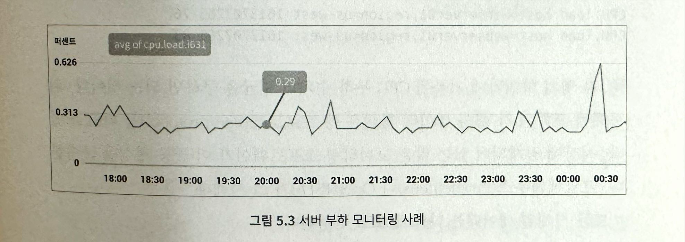

# 지표 모니터링 및 경보 시스템

# 문제 이해 및 설계 범위 확정

지표 모니터링 및 경보 시스템의 의미는 회사마다 다를 수 있기 때문에 면접관과의 대화에서 **요구사항을 정확하게 알아내는 것이 중요**함

**개략적 요구사항 및 가정**

- 대규모 인프라를 모니터링 해야 함
    - 일간 능동 사용자 수 1억 명
    - 서버 풀 1000개, 풀당 서버 수 100개
        - 서버 당 100개의 운영 지표를 수십
        - 모니터링해야 하는 지표의 수 = 천만 개
    - 데이터 보관 기간 1년
        - 수집한 그대로 데이터 보관 = 일주일
        - 1분 단위 데이터로 변환 후 보관 = 30일
        - 1식간 단위 데이터로 변환 후 보관 = 1년
- 모니터링할 지표
    - CPU 사용률
    - 요청 수
    - 메모리 사용량
    - 메시지 큐 내의 메시지 수

**비기능 요구사항**

- 규모 확장성
    - 시스템은 늘어나는 지표 수와 경보의 양에 맞게 확장될 수 있어야 함
- 낮은 응답 지연
    - 대시보드와 경보를 신속하게 처리할 수 있도록
- 안정성
    - 높은 안정성을 제공하여 중요 경보를 놓치지 않도록 해야 함
- 유연성
    - 기술은 계속 변화하기 때문에 미래의 신기술을 쉽게 통합할 수 있도록 유연하게 변경 가능한 파이프라인을 이용해 구축해야 함

**고려하지 않아도 되는 요구사항**

- 로그 모니터링
    - Elasticsearch, Logstatsh, Kibana 등이 로그 모니터링 용도로 널리 사용됨
- 분산 시스템 추적
    - 서비스에 대한 요청이 분산 시스템 내부를 어떻게 흘러다니는지 추적할 수 있도록 하는 시스템
    - 요청이 한 서비스에서 다른 서비스로 이동할 때마다 데이터를 수집

# 개략적 설계안 제시 및 동의 구하기

## 기본적 사항

**다섯 가지 컴포넌트를 이용함**

- 데이터 수집
    - 여러 출처로부터 지표 데이터를 수집
- 데이터 전송
    - 지표 데이터를 지표 모니터링 시스템으로 전송
- 데이터 저장소
    - 전송되어 오는 데이터를 정리하고 저장
- 경보
    - 밀려오는 데이터를 분석하고, 이상 징후를 감지하고, 경보를 발생
    - 다양한 통신 채널로 경보를 발송할 수 있어야 함
- 시각화
    - 데이터를 차트나 그래프 등으로 제공
    - 엔지니어는 데이터를 시각적으로 보여주면 패턴, 추이, 문제점을 더 쉽게 파악함

## 데이터 모델

지표 데이터는 통상 **시계열 데이터 형태**로 기록함

= 값 집합에 타임스탬프가 붙은 형태로 기록한다는 뜻

1. 프로덕션에서 사용 중인 서버 인스턴스 i631의 20:00 시점의 CPU 부하를 알고 싶음
    
    
    
    | metric_name | cpu.load |
    | --- | --- |
    | labels | host:1631,env:prod |
    | timestamp | 1613707265 |
    | value | 0.29 |
    - 지표 이름 + 레이블 + 특정한 시각에 측정된 지표 데이터
2. 지난 10분간 us-west 지역에 위치한 모든 웹 서버의 CPU 부하 평균 값은?
    - 지표 이름이 CPU.load이고 레이블에 포함된 지역 이름이 us-west인 데이터를 저장소에서 가져와 평균값 구하기
    
    ```bash
    CPU.load host=webserver01, region=us-west 1613707265 50
    CPU.load host=webserver01, region=us-west 1613707265 62
    CPU.load host-webserver02, region=us-west 1613707265 43
    CPU.load host=webserver02, region=us-west 1613707265 53
    •••
    CPU.load host=webserver01, region=us-west 1613707265 76
    CPU.load host=webserver01, region=us-west 1613707265 83
    ```
    
    - 각 행의 마지막에 기록된 CPU 부하 수치의 평균
    - 행 프로토콜 형식
        - 시장에 공개되어 있는 많은 모니터링 소프트웨어가 이 공통 형식을 준수함

**시계열 데이터의 구성**

| 이름 | 자료형 |
| --- | --- |
| 지표 이름 | 문자열 |
| 태그/레이블 집합 | <키:값>쌍의 리스트 |
| 지표 값 및 그 타임스템프의 배열 | <값, 타임스탬프>쌍의 배열 |

### 데이터 접근 패턴


- y축에 붙은 레이블은 하나의 시계열 데이터
- x축에 붙은 레이블은 시간
- 쓰기 부하가 막대함
    - 시점을 막론하고 많은 시계열 데이터가 기록될 수 있음(매일 천만 개)
    - 상당수의 지표는 발생 빈도도 높음
    
    ⇒ 쓰기 트래픽이 압도적
    
- 읽기 부하는 일시적으로 치솟았다가 사라짐
    - 시각호와 경보 서비스에서 읽기 연산이 발생
    - 그래프나 경보를 확인하는 패턴에 따라 읽기 연산이 일시적으로 증가함

## 데이터 저장소 시스템

본 설계안의 **핵심**으로 직접 설계하거나, MySQL 같은 범용의 저장소 시스템을 사용하는 선택지 어떤 것도 추천하지 않음

**범용 데이터베이스**

- 이론적으로는 시계열 데이터를 처리할 수 있음
- 본 설계안이 감당하려는 부하 규모에 맞추려서 전문가 수준의 튜닝이 필요
- 관계형 데이터베이스
    - 시계열 데이터를 대상으로 통상적으로 수행하는 연산에 최적화되어 있지 않음
        - 지수 평균 값을 지속적으로 갱신하는 질의문을 SQL로 작성한다고 가정했을 때 복잡해서 읽기 까다로울 것
        - 태그/레이블에 대한 질의를 지원하려면 태그마다 인덱스를 지정해야 함
    - 많은 양의 쓰기 연산이 지속적으로 발생하는 환경에서는 좋은 성능을  보이지 못함
- NoSQL
    - 시계열 데이터를 효율적으로 처리할 수 있다고 알려진 것들이 있기는 함
        - Casandra, Bigtable
    - 시계열 데이터를 효과적으로 저장하고 질의하기 위해서는 확장이 용이한 스키마를 설계해야 함
        - NoSQL에 대한 해박한 짓힉이 필요함

**시장에 나와있는 시계열 데이터에 최적화된 저장소 시스템**

- 같은 양의 시계열 데이터를 더 적은 서버에 보관할 수 있음
- 시계열 데이터 분석에 접합
- SQL보다 사용하기 쉬운 질의 인터페이스
- 데이터 보관 기관을 설정
- 데이터 집계 기능
- OpenTSDB
    - 분산 시계열 데이터베이스
    - 하둡과 HBase에 기반하고 있어서 해당 클러스터를 구성하고 운영해야 함 ⇒ 복잡
- Timestream
    - 아마존에서 출시한 제품
- InfluxDB
    - 시장에서 가장 인기 있는 시계열 데이터 베이스 1
    - 다량의 시계열 데이터를 저장하고 빠른 실시간 분석을 지원함
    - 메모리 캐시와 디스크 저장소를 함께 사용
    - 영속성 요건과 높은 성능 요구사항도 잘 만족함
- Prometheus
    - 시장에서 가장 인기 있는 시계열 데이터 베이스 2
    - InfluxDB 동일

이력서에 언급하지 않았다면 면접관도 내부 구조를 이해하는지 묻지 않을 것

**지표 데이터는 본질적으로 시계열 데이터이므로 InfluxDB나 Prometheus 같은 시계열 데이터베이스에 저장할 수 있음을 설명**하는 것이 중요

**좋은 시계열 데이터베이스**

- 막대한 양의 시계열 데이터를 레이블 기준으로 집계하고 분석하는 기능을 제공
- InfluxDB는 레이블 기간 신속한 데이터 질의를 지원하기 위해 레이블별로 인덱스를 구축
    - 레이블을 이용할 때 데이터베이스 과부하를 피하는 지침도 제공
- 각 레이블이 가질 수 있는 값의 가짓수가 낮아야 함
    - 데이터 시각화에 중요
    - 범용 데이터베이스로 구축하기는 까다로움

## 개략적 설계안


- 지표 출처
    - 지표 데이터가 만들어지는 곳
    - 애플리케이션 서버, SQL 데이터베이스, 메시지 큐 등 다 가능
- 지표 수집기
    - 지표 데이터를 수집하고 시계열 데이터에 기록
- 시계열 데이터베이스
    - 지표 데이터를 시계열 데이터 형태로 보관하는 저장소
    - 다량의 시계열 데이터를 분석하고 요약하는 데 적합하도록 설계된 질의 인터페이스를 제공
- 질의 서비스
    - 시계열 데이터베이스에 보관된 데이터를 질의하고 가져오는 과정을 돕는 서비스
    - 좋은 시계열 데이터베이스를 골랐다면 이 서비스는 많은 일을 하지 않아도 됨
        - 해당 데이터베이스의 질의 인터페이스로 대신할 수도 있음
- 경보 시스템
    - 경보를 받아야 하는 다양한 대상으로 경보 알림을 전송
- 시각화 시스템
    - 지표를 다양한 형태의 그래프/차트로 시각화 하는 기능을 제공

# 상세 설계

## 지표 수집

카운터나 CPU 사용량 같은 지표를 수집할 때는 데이터가 손실 되어도 아주 심각한 문제는 아님

지표를 보내는 클라이언트는 성공적으로 데이터가 전송이 되었는지 신경 쓰지 않아도 됨

**지표 데이터 수집 방법**

1. 풀 모델
2. 푸시 모델

**풀 모델**

- 실행 중인 애플리케이션에서 주기적으로 지표 데이터를 가져오는 지표 수집기가 이 흐름의 중심
- 지표 수집기는 데이터를 가져올 서비스 목록을 알아야 함
    - ‘지표 수집기’ 서버 안에 모든 서비스 엔드포인트의 DNS/IP 정보를 담은 파일을 두면 가장 간단함
    - 서버가 수시로 추가/삭제되는 대규모 운영 환경에는 적용하기 어려움
    - etcd, 아파치 주키퍼 같은 서비스 탐색 기술을 활용하면 해결 가능
    
    ⇒ 각 서비스는 자신의 가용성 관련 정보를 서비스 탐색 서비스에 기록
    
    ⇒ 서비스 탐색 서비스는 서비스 엔드포인트 목록에 변화게 생길 때마다 지표 수집기에 통보
    
- 서비스 탐색 기술을 사용하는 풀 모델 기반 지표 수집 흐름
    1. 지표 수집기는 SDS에서 서비스 엔드포인트 설정 메타데이터 목록을 가져옴
        - 각 메타데이터에는 지표 수집 주기, IP 주소, 타임아웃, 재시도 인자 등이 기록되어 있음
    2. 지표 수집기는 사전에 합의된 HTTP 엔드포인트에서 지표 데이터를 가져옴
    3. 이런 엔드포인트를 수집기에 노출하기 위해서, 통상 서비스에 특정 클라이언트 라이브러리를 추가함
    4. 지표 수집기는 서비스 엔드포인트 목록의 변화를 통지 받기 위한 변경 이벤트 알림 콜백을 서비스 탐색 컴포넌트에 등록할 수 있음
        - 이렇게 하는 대신 주기적으로 서비스 탐색 컴포넌트에서 엔드포인트 목록을 다시 가져와도 됨

수천 대 서버가 만들어 내는 지표 데이터를 수집하려면 지표 수집기 서버 한 대로는 부족함

지표 수집기 서버 풀을 만들어야 본 설계안에서 다루는 지표 데이터 규모를 감당 가능

**지표 수집기 서버를 여러 대 둘 때 흔히 빚어지는 문제**

- 여러 서버가 같은 출처에서 데이터를 중복해서 가져올 가능성이 있음
- 지표 수집 서버 간에 모종의 중재 메커니즘이 존재해야 함
    - 안전 해시 링
        - 해시 링 구간마다 해당 구간에 속한 서버로부터 생산되는 지표의 수집을 담당하는 수집기 서버를 지정하는 것
        - 특정 서버의 지표 데이터는 항상 하나의 수집 서버가 처리함을 보장할 수 있음

**푸시 모델**

- 지표 출처에 해당하는 서버(웹 서버, 데이터베이스 서버, …)가 직접 지표를 수집기에 전송하는 모델
- 모니터링 대상 서버에 통상 수집 에이전트라고 부르는 소픝으웨어를 설치함
- 수집 에이전트는 해당 장비에서 실행되는 서비스가 생산하는 지표 데이터를 받아 모은 다음 주기적으로 수집기에 전달함
- 간단한 카운터 지표의 경우에는 수집기에 보내기 전에 에이전트가 직접 데이터 집계 등의 작업을 처리할 수도 있음

**데이터 집계**

- 수집기에 보내는 데이터의 양을 줄이는 효과적인 방법
- 데이터 전송 트래픽의 양이 막대하여 수집기가 일시적으로 전송되는 데이터를 처리하지 못하게 되어 오류를 반환하면 에이전트는 내부의 소규모 버퍼에 데이터를 일시적으로 보관한 다음 나중에 재전송
- 에이전트가 위치한 서버 클러스트가 자동 규모 확장이 가능하도록 설정되어 있으면 서버가 동적으로 추가/삭제되는 과정에서 해당 데이터는 소신될 수도 있음

**푸시 모델을 채택한 지표 수집기가 밀려드는 지표 데이터를 제때 처리하지 못하는 일 방지**

- 지표 수집기 클러스터 자체도 자동 규모 확장이 가능하도록 구성하고 그 앞에 로드밸런서 두기
- 클러스터의 크기는 지표 수집기 서버 CPU 부하에 따라 자동으로 늘어나거나 줄어들도록 설정

**풀 vs 푸시 모델**

- 풀 모델 채택
    - 프로메테우스
- 푸시 모델 채택
    - 아마족 클라우드와치, 크래파이트

⇒ 장단점을 비교하여 상황에 적합한 모델을 선택해야 함

⇒ 면접에서는 어떤 모델을 선택하는지보다는 장단점을 비교할 수 있는지가 더 중요함

|  | 풀 모델 | 푸시 모델 |
| --- | --- | --- |
| 손쉬운 디버깅 |  |  |
| 상태 진단 |  |  |
| 생존 기간이 짧은 프로세스 |  |  |
| 방화벽 등의 복잡한 네트워크 구성 |  |  |
| 성능 |  |  |
| 데이터 신빙성 |  |  |

서버리스 기술이 각광 받음에 따라 많은 조직이 두 모델을 모두 지원하고 있음

⇒ 지표 수집 에이전트를 설지할 서버가 마땅히 존재하지 않을 수도 있음을 감안해야 함

## 지표 전송 파이프라인의 규모 확장

지표 수집기는 서버 클러스터 형태이며 엄청난 양의 데이터를 받아 처리해야 함

- 자동으로 규모 확장이 가능하도록 설정하여 언제나 데이터 처리에 충분한 수집기 서버가 존재하도록 해야 함
- 풀 모델과 푸시 모델 중에 무엇을 채택할지 여부와 관계 없음

시계열 데이터베이스에 장애가 생기면 데이터 손실이 발생할 수 있음

⇒ 큐를 두면 문제 해결 가능

**지표 수집기 → 카프카와 같은 큐 시스템 → 스트림 처리 서비스가 해당 데이터를 받아 시계열 데이터베이스에 저장**

- 카프카는 고도로 안정적이고 규모 확장성이 뛰어난 분산 메시지 플랫폼
- 데이터 수집 컴포넌트와 처리 컴포넌트 사이의 결합도를 낮춤
- 카프카에 보관해 두면 되기 때문에 데이터베이스에 장애가 생겨도 소실되지 않음

**카프카를 통한 규모 확장**

- 카프카에 내장된 파티션 메커니즘을 사용하면 시스템의 규모를 다양한 방법으로 확장 가능
- 대역폭 요구사항에 따라 파티션의 수를 설정
- 지표 이름에 따라 어떤 지표를 어느 파티션에 배치할지 결정하면 소비자는 지표 이름에 따라 데이터를 집계할 수 있음
- 태그/레이블에 따라 지표 데이터를 더욱 세분화한 파티션으로 나눔
- 중요 지표가 먼저 처리될 수 있도록 지표를 분류하고 우선순위를 지정

**카프카의 대안**

- 상용 규모의 카프카 시스템 구축은 쉽지 않아서 면접관이 카프카 도입을 반대할 수도 있음
- 큐 없이도 대규모 데이터 처리가 가능한 모니터링 시스템이 있기도 함
    - 페이스북의 메모리 기반 시계열 데이터베이스 시스템: 고릴라
    - 일부에 네트워크 장애가 발생해도 높은 수준의 쓰기 연산 가용성을 유지함

## 데이터 집계 시점

1. 수집 에이전트가 집계하는 방안
    - 클라이언트에 설치된 수집 에이전트는 복잡한 집계 로직은 지원하기 어려움
    - 어떤 카운터 값을 분 단위로 집계하여 지표 수집기에 보내는 정도는 가능
2. 데이터 수집 파이프라인에서 집계하는 방안
    - 데이터를 저장소에 기록하기 전에 집계할 수 있으려면 보통 플링크 같은 스트림 프로세싱 엔진이 피료함
    - 데이터베이스에는 계산 결과만 기록하기 때문에 실제로 기록되는 양이 엄청나게 줄어들 것
    - 늦게 도착하는 지표 데이터의 처리가 어려움
    - 원본 데이터를 보관하지 않기 때문에 정밀도나 유연성 측면에서는 손해
3. 질의 시에 집계하는 방안
    - 데이터를 날것 그대로 보관한 다음 질의할 때 필요한 시간 구간에 맞게 집계
    - 데이터 손실 문제는 없음
    - 속도가 느림

## 질의 서비스

- 질의서버 클러스터 형태로 구현
- 시각화 또는 경보 시스템에서 접수된 요청을 시계열 데이터베이스를 통해 처리하는 역할을 담당
- 질의 서비스를 두면 클라이언트와 시계열 데이터베이스 사이의 결합도를 낮출 수 있음

**캐시 계층**

- 질의 결과를 저장
- 시계열 데이터베이스에 대한 질의 부하를 낮추고 질의 서비스의 성능을 높일 수 있음

**질의 서비스를 두면 곤란한 경우**

- 대부분의 상용 시각화 및 경보 시스템은 시장에서 널리 사용되는 시계열 데이터베이스와 연동을 처리하는 강력한 플러그인을 이미 갖추고 있는 경우가 많음
- 별도 캐시를 도입할 필요가 없는 시계열 데이터베이스가 있음

**시계열 데이터베이스 질의어**

- SQL로는 질의하기 까다로움
- Flux(InfluxDB)라는 언어로 작성하면 쉬움
    
    ```sql
    from(db:"telegraf")
    	|> range(start:-1h)
    	|> filter(fn: (r) => r._measurement == "foo")
    	|> exponentialMovingAverage(size:-10s)
    ```
    

## 저장소 계층

시계열 데이터베이스는 신중하게 선택할 것

- 페이스북에서 내높은 연구 논문에 따르면 운영 데이터 저장소에 대한 질의의 85%는 지난 26시간 내에 수집된 데이터를 대상으로 함
- 이 사실을 잘 활용하여 시계열 데이터베이스를 고르면 성능 측면에서 큰 이득을 볼 수 있음

**저장 용량 최적화**

1. 데이터 인코딩 및 압축
    - 좋은 시계열 데이터베이스는 대부분 이 기능을 내장하고 있음
    - ex) 10초만큼만 다른 값
        - 타임스템프 하나를 온전치 표현하는 데는 32비트가 필요하지만 10을 표현하는 데는 4비트면 충분
        - 데이터를 완전한 형태로 저장하는 대신 기준 값과의 차이를 저장
2. 다운 샘플링
    - 데이터의 해상도를 낮춰 저장소 요구량을 줄이는 기법
    - ex) 본 설계안에 요구된 데이터 보관 기간은 1년이기 때문에 낡은 데이터는 해상도를 줄여도 됨
        - 7일 이내 데이터: 샘플링을 적용하지 않음
        - 30일 이내 데이터: 1분 해상도로 낮춰 보관
        - 1년 이내 데이터: 1시간 해상도로 낮춰 보관
3. 냉동 저장소
    - 잘 사용되지 않는 비활성 상태 데이터를 보관하는 곳
    - 냉동 저장에 드는 비용은 일반 저장소에 비해 훨씬 낮음

## 경보 시스템

직접 만들기보다는 상용품을 가져다 쓰는 것이 훨씬 나음

**경보 처리 흐름**

1. 설정 파일을 가져와 캐시 서버에 보관
    - 경보 규칙은 디스크에 파일 상태로 보관
    - 규칙을 정의하는 데는 YAML이 많이 사용됨
2. 경보 관리자는 경보 설정 내역을 캐시에서 가져옴
3. 설정된 규칙에 근거하여 경보관리자는 지정된 시간마다 질의 서비스를 호출함
4. 질의 결과가 설정된 임계값을 위반하면 이벤트를 생성함
    - 그 외에도 여러 작업을 수행함
        - 결보 필터링, 병합, 중복 제거
        - 접근 제어
        - 재시도
5. 경보 저장소는 카산드라 같은 형태의 키-값 저장소로 모든 경보의 사태가 보관되고, 알림이 적어도 한 번 이상 전달되도록 보장하는 구실을 함
6. 경보 이벤트를 카프카에 전달
7. 경보 소비자는 카프카에서 경보 이벤트를 읽음
8. 경보 소비자는 카프카에서 읽은 경보 이벤트를 처리하여 이메일, 단문 메시지, 페이저듀티, HTTP 서비스 엔드포인트 등의 다양한 채널로 알림을 전송

**만들 것인가 or 구매할 것인가**

기업이 필요로 하는 규모를 바로 지원 가능한 경보 시스템은 시장에 많음

- 유명 시계열 데이터베이스와 통합되어 있음
- 다양한 알림 채널을 지원함

⇒ 실무에서는 경보 시스템을 밑바닥부터 구현하겠다는 아이디어는 수용되기 어려움

⇒ 면접에서는 본인 선택을 정당화할 수 있도록 준비해야 함

## 시각화 시스템

품질 좋은 시각화 시스템을 구현하기 어렵기 때문에 직접 만들기보다는 상용품을 가져다 쓰는 것이 훨씬 나음

- 데이터 계층 위에 만들어짐
- 지표 대시보드에는 지표를 다양한 시간 범위로 표시
- 경보 대시보드에는 다양한 경보의 상태를 표시

# 마무리

**최종 설계안**


