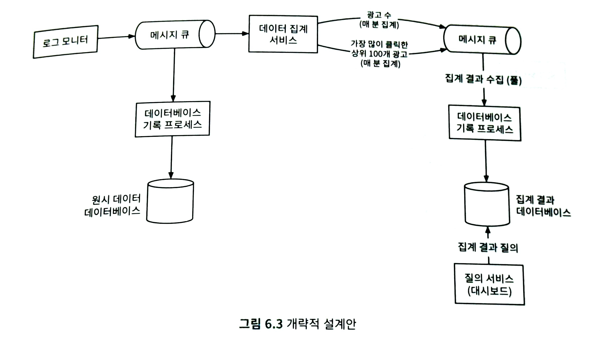

# 광고 클릭 이벤트 집계

**온라인 광고**

실시간 데이터를 통해 광고 효과를 정량적으로 측정할 수 있음

**Real-Time Bidding**

- 실시간 경매
- 디지털 광고의 핵심 프로세스
- 경매 절차를 통해 광고가 나갈 지면을 거래함

속도와 데이터의 정확성이 중요함

**광고 클릭 이벤트 집계**

온라인 광고가 얼마나 효율적이었는지 측정하는 데 결정적인 역할

⇒ 광고주가 얼마나 많은 돈을 지불할지에 영향을 끼침

**핵심 지표**

- CTR(클릭률)
- CVR(전환률)

# 문제 이해 및 설계 범위 확정

**기능 요구사항**

- 지난 M분 동안의 ad_id 클릭 수 집계
- 매분 가장 많이 클릭된 상위 100개 광고 아이디를 반환
- 다양한 속성에 따른 집계 필터링을 지원
- 데이터의 양은 페이스북이나 구글 규모

**비기능 요구사항**

- 집계 결과 정확성은 데이터가 RTB 및 광고 과금에 사용되므로 중요
- 지연되거나 중복된 이벤트를 적절히 처리할 수 있어야 함
- 견고성
    - 부분적인 장애는 감내할 수 있어야 함
- 지연 시간 요구사항
    - 전체 처리 시간은 최대 수 분을 넘지 않아야 함

**개략적 추정**

- DAU = 10억 명
- 각 사용자는 하루에 평균 1개 광고를 클릭한다고 가정
- 광고 클릭 QPS = 10^9 이벤트 / 하루 10^5초 = 10000
- 최대 광고 QPS는 평균 QPS의 5배 = 50000
- 광고 클릭 이벤트 하나당 0.1KB의 저장용량 필요
- 일일 저장소 요구량 = 0.1KB * 10억 = 100GB
- 월간 저장 요구량 = 3TB

# 개략적 설계안 제시 및 동의 구하기

### 질의 API 설계

목적은 클라이언트와 서버 간의 통식 규약을 만드는 것

1. 지난 M분간 각 ad_id에 발생한 클릭 수 집계
2. 지난 M분 동안 가장 많은 클릭이 발생한 상위 N개 ad_id 목록 반환
3. 다양한 속성을 기준으로 집계 결과를 필터

### 데이터 모델

**원시 데이터**

로그 파일에 포함된 원시 데이터

여러 애플리케이션 서버에 산재해 있음

```sql
[AdClickEvent] ad001, 2021-01-01 00:00:01, user1, 207.148.22.22, USA
```

| ad_id | click_timestamp | user_id | ip | country |
| --- | --- | --- | --- | --- |
| ad001 | 2021-01-01 00:00:01 | user1 | 207.148.22.22 | USA |
| ad001 | 2021-01-01 00:00:02 | user1 | 207.148.22.22 | USA |
| ad002 | 2021-01-01 00:00:02 | user2 | 209.153.56.11 | USA |

**집계 결과 데이터**

1. 집계 결과 테이블
    
    
    | ad_id | click_minute | filter_id | count |
    | --- | --- | --- | --- |
    | ad001 | 202101010000 | 0012 | 2 |
    | ad001 | 202101010000 | 0023 | 3 |
    | ad001 | 202101010001 | 0012 | 1 |
    | ad001 | 202101010001 | 0023 | 6 |
2. 필터 테이블
    
    
    | filter_id | region | ip | user_id |
    | --- | --- | --- | --- |
    | 0012 | US | 0012 | * |
    | 0013 | * | 0023 | 123.1.2.3 |
3. M분 동안 가장 많이 클릭된 상위 N개의 광고를 반환하는 질의를 지원하는 테이블
    
    
    | window_size | integer | 분 단위로 표현된 집계 윈도 크리 |
    | --- | --- | --- |
    | update_time_minute | timestamp | 마지막으로 갱신된 타임스탬프(1분 단위) |
    | most_clicked_ads | array | JSON 형식으로 표현된 ID 목록 |

**원시 데이터 vs 집계 결과 데이터**

|  | 원시 데이터만 보관 | 집계 데이터만 보관 |
| --- | --- | --- |
| 장점 | - 원본 데이터를 손실 없이 보관
- 데이터 필터링 및 재계산 지원 | - 데이터 용량 절감
- 빠른 질의 성능 |
| 단점 | - 막대한 데이터 용량
- 낮은 질의 성능 | - 데이터 손실
- 원본 데이터가 아닌 계산/유도된 데이터를 저장하는 데서 오는 결과 |

⇒ 둘 다 저장해라!

- 문제가 발생하면 디버깅에 활용할 수 있도록 원시 데이터도 보관하는 것이 좋음
    - 데이터가 손상되면 원시 데이터에서 집계 결과를 다시 만들 수 있음
- 원시 데이터는 양이 많아서 직접 질의하는 것은 비효율 적이기 때문에 집계 결과 데이터를 저장하여 이데이터를 질의하는 것이 바람직함
- 원시 데이터 = 백업 데이터
    - 오래된 데이터는 냉동 저장소로 옮겨서 비용 절감
- 집계 결과 데이터는 활성 데이터 구실을 함
    - 질의 성능을 높이기 위해 튜닝

**올바른 데이터베이스의 선택**

1. 데이터는 어떤 모습인가? 관계형 데이터인가? 문서 데이터인가? 아니면 이진 대형 객체인가?
2. 작업 흐름이 읽기 중심인가 쓰기 중심인가? 아니면 둘 다인가?
3. 트랜잭션을 지원해야 하는가?
4. 질의 과정에서 SUM이나 COUNT 같은 온라인 분석 처리 함수를 많이 사용해야 하는가?

- 원시 데이터
    - 백업, 재계산 용도로만 이용이 되기 때문에 읽기 연산 빈도가 낮음
    - 쓰기 연산 중심
    - 관계형 데이터 베이스로는 이정도 규모의 쓰기 연산이 가능하도록 구성하기 어려움
    - 쓰기 및 시간 범위 질의에 최적화된 카산드라나 InfluxDB를 사용하는 것이 바람직
- 집계 데이터
    - 시계열 데이터
    - 읽기 연산, 쓰기 연산 둘 다 많이 사용함
    - 원시 데이터와 같은 유형의 데이터베이스를 활용하는 것이 가능

### 개략적 설계안



### 비동기 처리

트래픽이 갑자기 증가하여 발생하는 이벤트 수가 소비자의 처리 용량을 훨씬 넘어서는 경우, 메모리 부족 등의 이슈가 발생할 수 있음

⇒ 카프카와 같은 메시지 큐를 도입하여 생산자와 소비자의 결합 끊기

⇒ 전체 프로세스는 비동기 방식으로 동작

⇒ 생상자와 소비자의 규모를 독립적으로 확장해 나갈 수 있음

**데이터베이스 기록 프로세스**

메시지 큐에서 데이터를 꺼내 데이터베이스가 지원하는 형식으로 변환한 다음 기록하는 역할

**첫 번째 메시지 큐**

광고 클릭 이벤트 데이터가 기록됨

⇒ 원시 데이터

**두 번째 메시지 큐**

1. 분 단위로 집계된 광고 클릭수
2. 분 단위로 집계한 가장 많이 클릭한 상위 N개 광고

⇒ 집계 데이터

**집계 결과를 데이터베이스에 바로 기록하지 않는 이유**

정확하게 한 번 데이터를 처리하기 위해 카프카와 같은 시스템을 두 번째 메시지 큐로 도입해야 하기 때문

### 집계 서비스

**유형 비순환 그래프(DAG)**

- 맵 리듀스 패러다임을 표현하기 위한 모델
- 맵/집계/리듀스 노드 등의 작은 컴퓨팅 단위로 세분화하는 것이 DAG의 핵심
    - 각 노드는 한 가지 작업만 처리하고 그 결과를 다음 노드에 인계함
- 빅데이터를 입력으로 받아 병렬 분산 컴퓨팅 자원을 활용하여 빅데이터를 작거나 일반적인 크기의 데이터로 변환할 수 있도록 설계된 모델
- 중간 데이터는 메모리에 저장될 수 있음
- 노드 간 통신은 TCP나 공유 메모리로 처리할 수 있음
    - 노드들이 서로 다른 프로세스에서 실행되는 경우 → TCP
    - 노드들이 서로 다른 스레드에서 실행되는 경우 → 공유 메모리

**맵 노드**

- 데이터 출처에서 읽은 데이터를 필터링하고 변환하는 역할
- ex) [ad_id % 2 == 0] 조건을 만족하는 데이터는 노드 1, 그렇지 않은 데이터는 노드 2로 전송
- 필수일까?
    - 카프카 파티션이나 태그를 구성한 다음에 집계 노드가 카프카를 직접 구독하는 것은?
    - 입력 데이터를 정리하거나 정규화해야 하는 경우에는 맵 노드가 필요함
    - 데이터가 생성되는 방식에 대한 제어권이 없는 경우에는 동일한 ad_id를 갖는 이벤트가 서로 다른 카프카 파티션에 입력될 수도 있음

**집계 노드**

- ad_id별 광고 클릭 이벤트 수를 매 분 메모리에서 집계
- 맵리듀스 패러다임에서 집계 노드는 리듀스 프로세스의 일부
- 맵-집계-리듀스 프로세스 = 맵-리듀스-리듀스 프로세스

**리듀스 노드**

- 모든 집계 노드가 산출한 결과를 최종 결과로 축약
- ex) 집계 노드 각각은 자기 관점에서 가장 많은 클릭이 발생한 광고 3개를 추려 리듀스 노드로 보내고, 리듀스 노드는 그 결과를 모아 최종적으로 3개의 광고만 남김

**주요 사용 사례**

1. 클릭 이벤트 수 집계
    - 맵 노드는 시스템에 입력되는 이벤트를 [ad_id % 3]을 기준으로 분배
    - 분해나 결과는 각 집계 노드가 집계
2. 가장 많이 클릭된 상위 N개 광고 반환
    - 입력 이벤트는 ad_id 기준으로 분배되고 각 집계 노드는 힙을 내부적으로 사용하여 상위 N개 광고를 효율적으로 식별
    - 마지막 단계의 리듀스 노드는 전달 받은 M개의 광고 가운데 지난 1분간 가장 많이 클릭된 광고 N개를 골라냄
3. 데이터 필터링
    - 필터링 기준을 사전에 정의한 다음 해당 기준에 따라 집계하는 스타 스키마 기법
        - 데이터 웨어하우스에서 널리 쓰이는 기법
        - 필터링에 사용되는 필드 = 차원
        - 장점
            - 이해하기 쉽고 구축하기 간단
            - 기존 집계 서비스를 재사용 가능
            - 결과를 미리 계산해 두는 방식이기 때문에 필터링 기준에 따라 빠르게 접근할 수 있음
        - 단점
            - 많은 버킷과 레코드가 생성된다는 한계가 있음
            - 필터링 기준이 많을 수록 더욱 그럼

# 상세 설계

### 스트리밍 vs 일괄 처리

**본 설계안은 스트림 처리와 일괄 처리 방식을 모두 사용함**

- 데이터를 오는 대로 처리하고 거의 실시간으로 집계된 결과를 생성할 때 → 스트림 처리
- 이력 데이터를 백업할 때 → 일괄 처리

⇒ 람다

- 두 가지 처리 경로를 지원해야 하기 때문에 유지 관리해야 할 코드가 두 벌임

⇒ 일괄 처리와 스트리밍 처리 경로를 하나로 결합하는 카파 아키텍처를 통해 해결

⇒ 단일 스트림 처리 엔진을 사용하여 실시간 데이터 처리 및 끊임없는 데이터 재처리 문제를 모두 해결

**데이터 재계산**

- 이미 집계한 데이터를 다신 계산하는 경우
    - 데이터 재처리
- 재계산 프로세스는 집계 서비스를 재사용하기는 하지만 처리 데이터는 다른 곳에서 읽음
    - 원시 데이터를 직접 읽음
- 흐름
    1. 원시 데이터 저장소에서 데이터를 검색함
        - 일괄 처리 프로세스를 따름
    2. 추출된 데이터는 전용 집계 서비스로 전송
        - 전용 집계 서비스를 두는 이유는 실시간 데이터 처리 과정이 과거 데이터 재처리 프로세스와 간섭하는 일을 막기 위해서
    3. 집계 결과는 두 번째 메시지 큐로 전송되어 집계 결과 데이터베이스에 반영

### 시간

**집계에 사용하는 타임스탬프**

- 이벤트 시각
    - 광고 클릭이 발생한 시각
- 처리 시각
    - 집계 서버가 클릭 이벤트를 처리한 시스템 시각
- 네트워크 지연이나 비동기적 처리 환경 때문에 이벤트가 발생한 시각과 처리 시각 차이에 격차가 커질 수 있음

|  | 장점 | 단점 |
| --- | --- | --- |
| 이벤트 발생 시각 | 광고 클릭 시점을 정확히 아는 것은 클라이언트이기 때문에 집계 결과가 보다 정확함 | 클라이언트가 생성한 타임스탬프에 의종하는 방식이기 때문에 클라이언트에 설정된 시간이 잘못되었거나 악성 사용자가 타임스탬프를 고의로 조작하는 문제에서 자유로울 수 없음 |
| 처리 시각 | 서버 타임스탬프가 클라이언트 타임스탬프보다 안정적임 | 이벤트가 시스템에 도착한 시각이 한참 뒤인 경우에는 집계 결과가 부정확해짐 |

데이터 정확도는 아주 중요하기 때문에 이벤트 발생 시각을 사용할 것을 추천함

**시스템에 늦게 도착한 이벤트를 올바를게 처리하는 방법**

- 워터마크
    - 각 윈도 마지막에 붙은 여분의 사각형
    - 집계 윈도의 확장
    - 크기는 비즈니스 요구사항에 따라 달라짐
        - 길면 늦게 도착하는 이벤트도 포착 가능하지만 이벤트 처리 시간이 늘어남
        - 짧으면 데이터 정확도는 떨어지지만 시스템의 응답 지연은 낮아짐
    - 시간이 한참 으른 후에 시스템에 도달하는 이벤트는 처리할 수 없음
    - 발생할 확률이 낮은 이벤트 처리를 위해 시스템을 복잡하게 설계하면 투자 대비 효능이 떨어짐
    - 사소한 데이터 오류는 하루치 데이터 처리를 마감할 때 조정 가능
    
    ⇒ 데이터의 정확도는 높아지지만 대기 시간이 늘어나 전반적인 지연 시간이 늘어남
    

### 집계 윈도

**텀블링 윈도**

- 시간을 같은 크기의 겹치지 않는 구간으로 분할
- 매 분 발생한 클릭 이벤트를 집계하기에 적합

**슬라이딩 윈도**

- 데이터 스트림을 미끄러져 나아가면서 같은 시간 구간 안에 있는 이벤트를 집계
- 서로 겹칠 수 있음
- 지난 M분간 가장 많이 클릭된 상위 N개 광고를 알아내기에 적합

### 전달 보장

집계 결과는 과금 등에 활용될 수 있기 때문에 데이터의 정확성과 무결성이 아주 중요함

1. 이벤트의 중복 처리는 어떻게 피할 수 있는가?
2. 모든 이벤트 처리를 어떻게 보장할 수 있는가?

**어떤 전달 방식을 선택할 것인가**

- 약간의 중복은 허용한다면 ‘최소 한 번’이 적합
- 본 설계안이 다루는 시스템은 데이터의 몇 퍼센트 차이가 수백만 달러 차이로 이어질 수 있음

⇒ ‘정확히 한 번’이 적합

**데이터 중복 제거**

- 데이터 중복이 발생하는 곳
    - 클라이언트
        - 한 클라이언트가 같은 이벤트를 여러 번 보내는 경우
        - 악의적인 의도로 전송되는 중복 이벤트를 처리하는 데는 광고 사기/위험 제어 컴포넌트가 적합
    - 서버 장애
        - 집계 도중에 집계 서비스 노드에서 장애가 발생하였고 업스트림 서비스가 이벤트 메시지에 대해 응답을 받지 못한 경우
- ex) 집계 서비스 노드에 발생한 장애의 결과로 중복 데이터가 생기는 경우
    - 이 노드는 업스트림 카프카에 오프셋을 저장하여 데이터 소비 상태를 관리함
    1. 집계 서비스 노드에 장애가 생겨 6단계를 실행하지 못하면 100에서 110까지의 이벤트는 이미 다운스트림에 전송되었으나 새 오프셋은 업스트림 카프카에 반영되지 않음
    2. 새로 복구된 집계 서비스 노드는 오프셋 100부터 이벤트를 다시 소비할 것이고, 그 결과로 데이터 중복이 발생
- HDFS나 SC 같은 외부 파일 저장소에 오프셋을 기록하는 해결책
    - 집계 결과를 다운스트림으로 전송하기 전에 오프셋을 외부 파일 저장소에 저장
    - 저장 직후 집계 서비스 노드에 장애가 발생하면 그 사이에 있는 데이터는 손실이 됨
    
    ⇒ 다운스트림에서 집계 결과 수신 확인 응답을 받은 후에 오프셋을 저장해야 함함
    

대규모 시스템에서 데이터 중복을 없애기는 쉽지 않음

이벤트를 정확히 한 번 처리하는 것은 난이도가 아주 높은 작업임

### 시스템 규모 확장

**메시지 큐의 규모 확장**

- 생산자
    - 생산자 인스턴스 수에는 제한을 두지 않기 때문에 확장성 쉽게 달성 가능
- 소비자
    - 소비자 그룹 내의 재조정 메커니즘은 노드 추가/삭제를 통해 그 규모를 쉽게 조정할 수 있게 함
    - 소비자가 많은 경우에는 재조정 작업이 오래 걸리기 때문에 시스템 사용량이 많지 않은 시간에 실행하여 영향을 최소화하는 것이 좋음

**브로커**

- 해시 키
    - 같은 ad_id를 갖는 이벤트를 같은 카프카 파티션에 저장하기 위해 ad_id를 해시 키로 사용
    - 집계 서비스는 같은 ad_id를 갖는 이벤트를 전부 같은 파티션에서 구독 가능
- 파티션의 수
    - 파티션의 수가 변하면 같은 ad_id를 갖는 이벤트가 다른 파티션에 기록되는 일이 생길 수 있음
    - 사전에 충분한 파티션을 확보하여 프로턱션 환경에서 파티현의 수가 동적으로 늘어나는 일을 피하는 것이 좋음
- 토픽의 물리적 샤딩
    - 보통 하나의 토픽만으로 충분한 경우가 없기 때문에 지역 혹은 사업 유형에 따라 여러 토픽 두기
    - 데이터를 여러 토픽으로 나누면 시스템의 처리 대역폭을 높일 수 있음
    - 단일 토픽에 대한 소비자의 수가 줄면 소비자 그룹의 재조정 시간도 단축됨
    - 복잡성이 증가함
    - 유지 관리 비용이 늘어남

**집계 서비스의 규모 확장**

- 노드의 추가/삭제를 통해 수평적으로 조정이 가능함
- 집계 서비스의 처리 대역폭을 높이려면 어떻게 해야 할까?
    1. ad_id마다 별도의 처리 스레드를 두는 방안
        - 구현하기 쉬움
        - 자원 공급자에 대한 의존 관계가 없음
    2. 집계 서비스 노드를 아파치 하둡 YARN 같은 자원 공급자에 배포하는 방식
        - 다중 프로세싱을 활용함
        - 더 많은 컴퓨팅 자원을 추가하여 시스템 규모를 확장할 수 있기 때문에 실제로 더 많이 사용됨

**데이터베이스의 규모 확장**

- 카산드라는 안정 해시와 유사한 방식으로 수평적인 규모 확장을 지원
- 데이터는 각 노드에 균등하게 분산
    - 사본도 적당한 수만큼 만들어 분산
- 각 노드는 해시 링 위의 특정 해시 값 구간의 데이터 보관을 담당
    - 다른 가상 노드의 데이터 사본도 보관
- 클러스터에 새 노드를 추가하면 가상 노드 간의 균형은 자동으로 다시 조정됨
    - 수동으로 샤딩을 조정하는 과정은 필요하지 않음

### 핫스팟 문제

**핫스팟**

- 다른 서비스나 샤드보다 더 많은 데이터를 수신하는 서비스나 샤드

많은 예산을 집행하는 회사의 광고는 더 많은 클릭이 발생하기 때문에 핫스팟 문제가 발생할 수 있음

핫스팟 문제는 서버 과부하 문제로 이어짐

⇒ 더 많은 집계 서비스 노드를 할당하여 해결

⇒ 전역-지역 집계, 분할 고유 집계 방식도 있지만 복잡함

**더 많은 집계 서비스 노드를 할당하는 방법**

1. 집계 서비스 노드에 300개 이벤트가 도착하여 한 노드가 감당할 수 있는 양을 초과함
2. 자원 관리자에게 추가 자원을 신청
3. 자원 관리자는 해당 서비스 노드에 과부하가 걸리지 않도록 추가 자원을 할당
4. 원래 집계 서비스 노드는 각 서비스 노드가 100개씩의 이벤트를 처리할 수 있도록 이벤트를 세 개 그룹으로 분할
5. 집계가 끝나 축약된 결과는 다시 원래 집계 서비스 노드에 기록

### 집계 서비스의 결함 내성

- 집계는 메모리에서 이루어지기 때문에 집계 노드에 장애가 생기면 집계 결과도 손실됨
- 업스트림 카프카 브로커에서 이벤트를 다시 받아오면 그 숫자를 다시 만들어 낼 수 있음
- 카프카 데이터를 원점부터 다시 재생하여 집계하면 시간이 오래 걸림
- 업스트림 오프셋 같은 ‘시스템 상태’를 스냅숏으로 저장하고 마지막으로 저장된 상태부터 복구하는 것이 바람직
- 지난 M분간 가장 많이 클릭된 광고 N개 같은 데이터도 시스템 상태의 일부로 저장해야 함
- 스냅숏을 이용하면 집계 서비스의 복구 절차가 단순해짐
- 어떤 집계 서비스 노드 하나에 장애가 발생하면 해당 노드를 새 것으로 대체한 다음 마지막 스냅숏에서 복구하면 됨
- 스냅숏을 마지막으로 찍은 후에 도착한 새로운 이벤트는 새 집계 서비스 노드가 카프카 브로커에서 읽어가 처리할 것

### 데이터 모니터링 및 정확성

**지속적 모니터링**

- 지연 시간
    - 데이터를 처리하는 각 단계마다 지연시간이 추가될 수 있기 때문에 시스템의 중요 부분마다 시각 추적이 가능하도록 해야 함
    - 기록된 시각 사이의 차이를 지연 시간 지표로 변환해서 모니터링
- 메시지 큐 크기
    - 큐의 크기가 갑자기 늘어난다면 더 많은 집계 서비스 노드를 추가해야 할 수 있음
- 집계 노드의 시스템 자원
    - CPU
    - 디스크
    - JVM

**조정**

- 다양한 데이터를 비교하여 데이터 무결성을 보증하는 기법
- 매일 각 파티션에 기록된 클릭 이벤트를 이벤트 발생 시각에 따라 정렬한 결과를 일괄 처리하여 만들어 낸 후 실시간 집계 결과와 비교하기
- 더 높은 정확도가 필요하면 더 작은 집계 윈도 사용
- 윈도 크기에 관계없이 일부 이벤트는 늦게 도착할 수 있기 때문에 배치 작업 결과가 실시간 집계 결과와 정확히 일치하지 않을 수 있다는 점에 유념

### 대안적 설계안

사고 프로세스를 설명하고 타협적 선택지 사이의 장단점을 설명하는 능력을 보이는 것이 중요함

**다른 설계 방법**

- 광고 클릭 데이터를 하이브에 저장
- 빠른 질의는 일래스틱서치 계층을 얹어서 처리하기
- 집계는 클릭하우스나 드루이드 같은 OLAP 데이터베이스를 통해 처리하기

# 마무리

**참 잘했어요~!**


